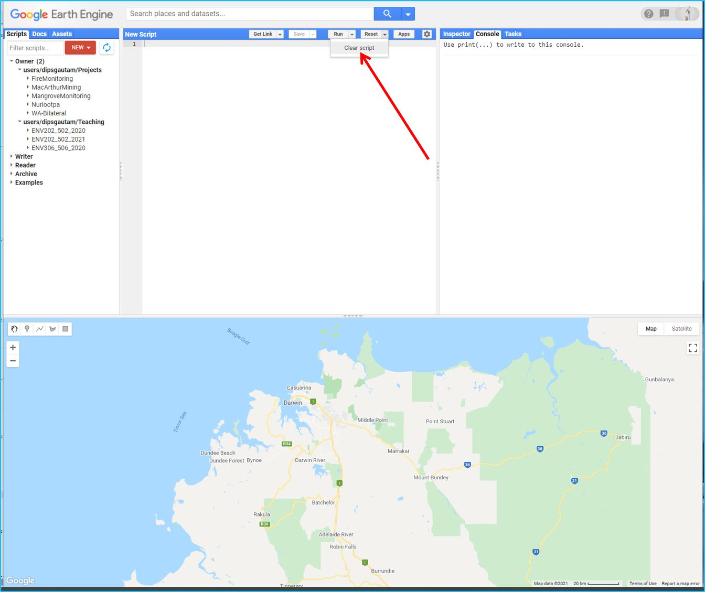
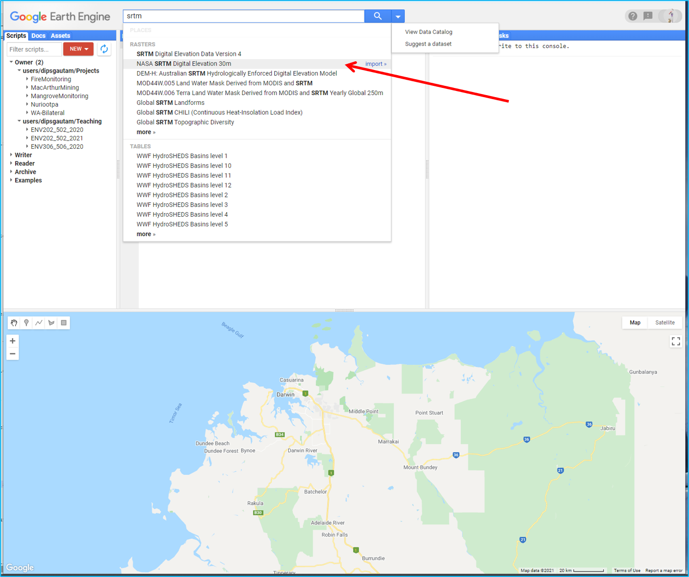
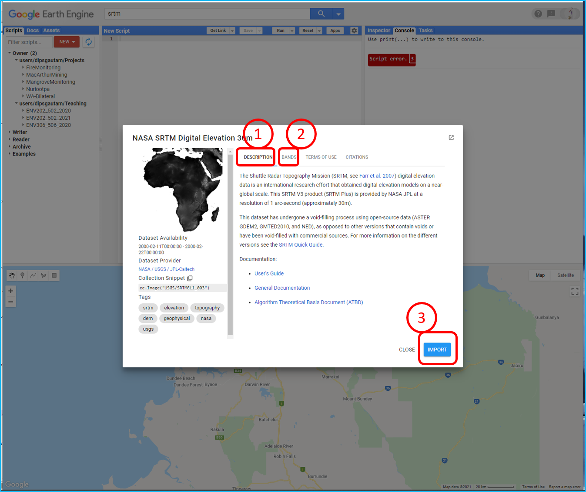
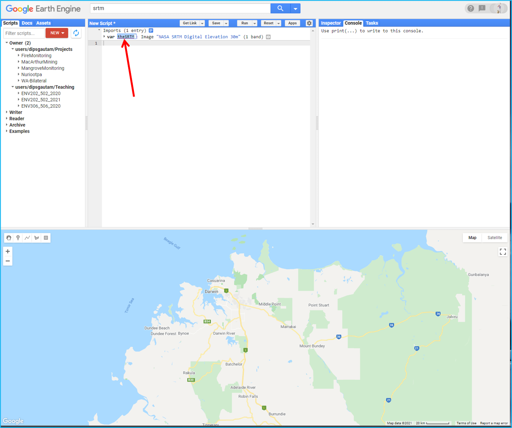
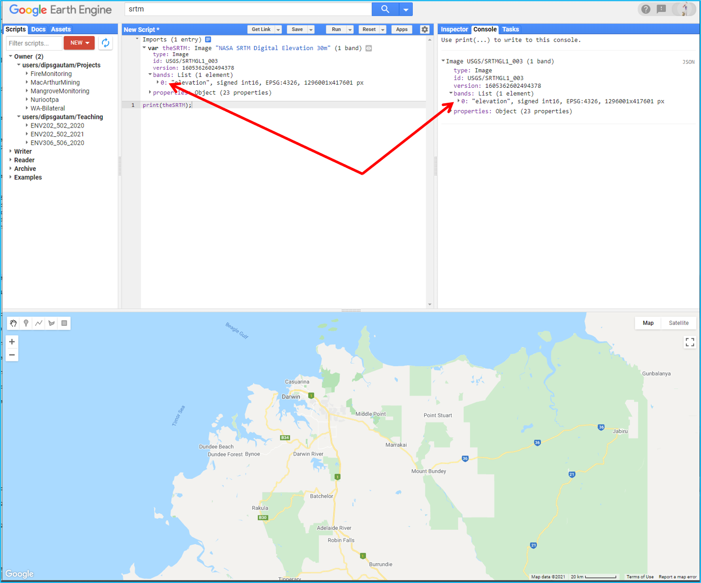
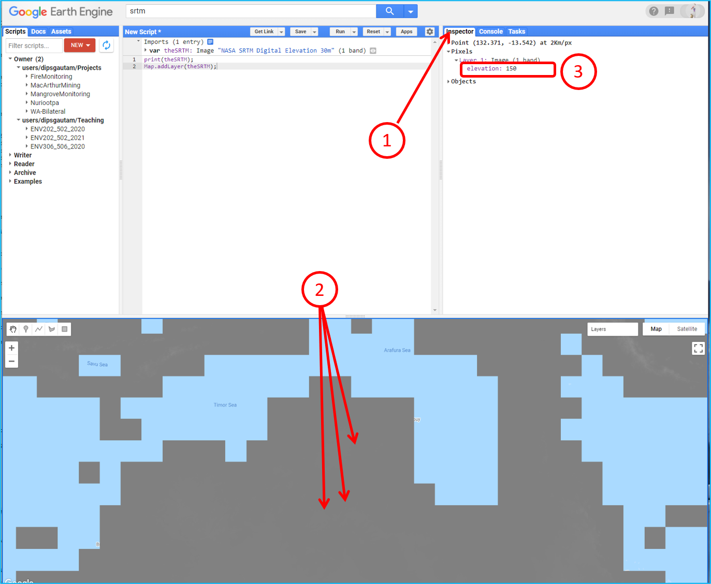
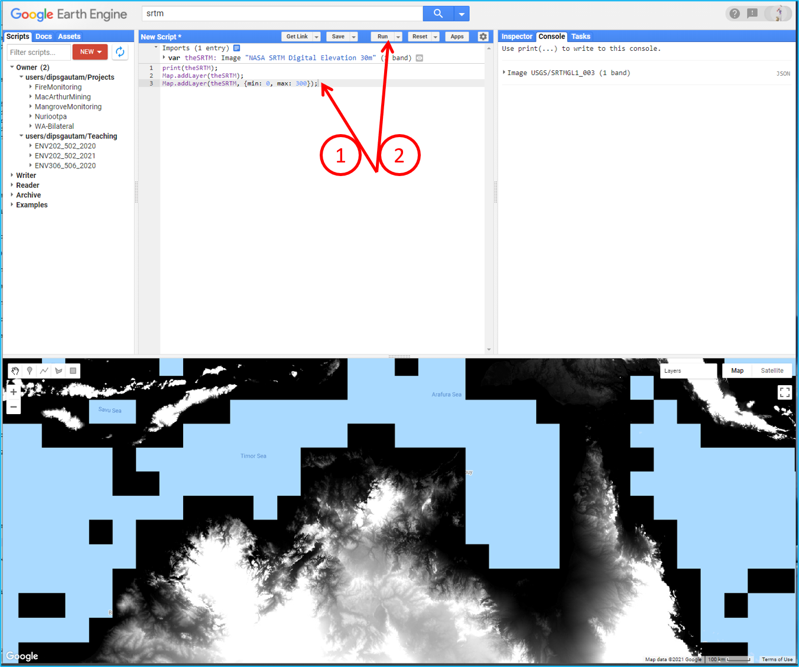
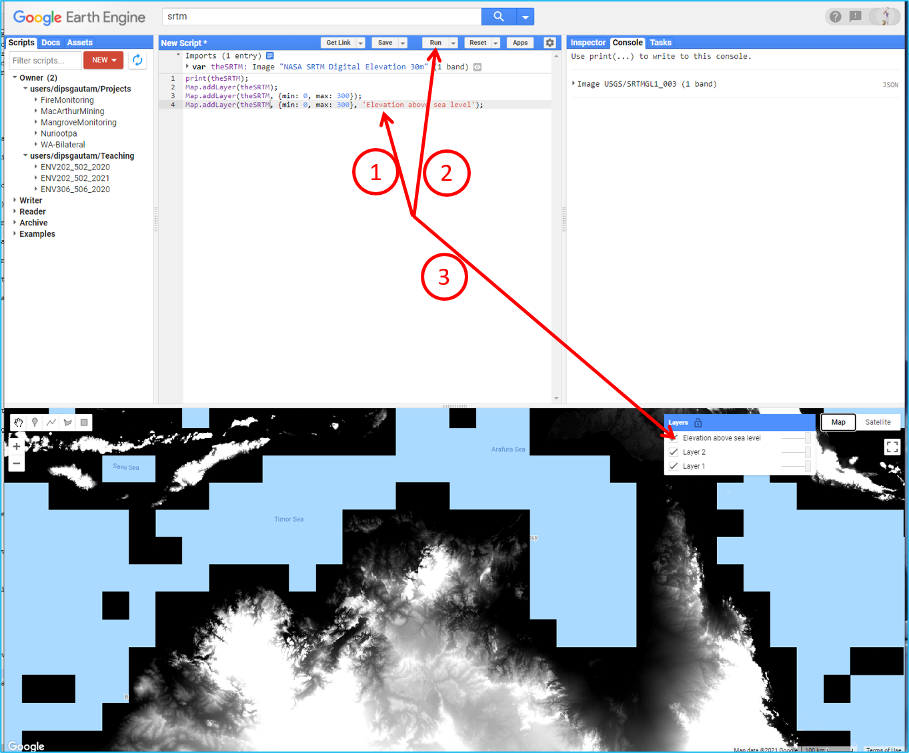
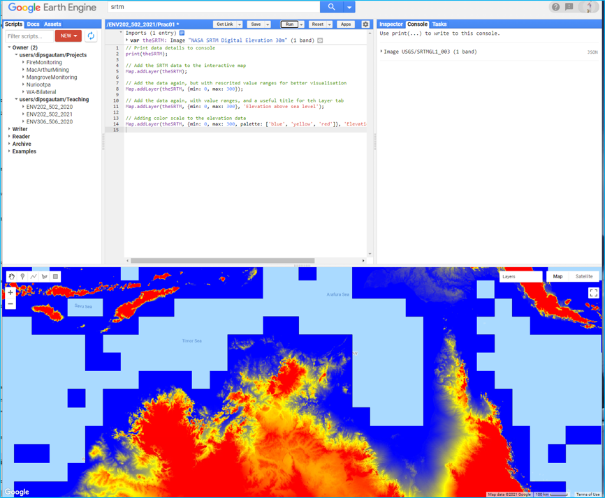

# Introduction to Remote Sensing of the Environment
Prac 1 - Getting started with Google Earth Engine
--------------

### Acknowledgments 
- Google Earth Engine Team
- Earth Engine Beginning Curriculum

------

### Prerequisites
-------------

Completion of this lab exercise requires use of the Google Chrome browser and a Google Earth Engine account. If you have not yet signed up - please do so now in a new tab: [Earth Engine account registration](https://signup.earthengine.google.com/)

Once registered you can access the Earth Engine environment here: https://code.earthengine.google.com

Google Earth Engine uses the JavaScript programming language. We will cover the very basics of this language during this course. If you would like more detail you can read through the introduction provided here: [JavaScript background](https://developers.google.com/earth-engine/tutorials/tutorial_js_01)

------------------------------------------------------------------------

### Objective
---------

The objective of this lab is to give you an introduction to the Google Earth Engine processing environment. By the end of this exercise you will be able to search, find and visualise a broad range of remotely sensed datasets. We will start with single-band imagery - elevation data from the [SRTM mission](https://www2.jpl.nasa.gov/srtm/).

## 1. The Earth Engine code editor


1. Editor Panel
	- The Editor Panel is where you write and edit your Javascript code
2. Right Panel
	- Console tab for printing output.
	- Inspector tab for querying map results.
	- Tasks tab for managing long­ running tasks.
3. Left Panel
	- Scripts tab for managing your programming scripts.
	- Docs tab for accessing documentation of Earth Engine objects and methods, as well as a few specific to the Code Editor application
	- Assets tab for managing assets that you upload.
4. Interactive Map
	- For visualizing map layer output
5. Search Bar
	- For finding datasets and places of interest
6. Help Menu
	- User guide ­ reference documentation
	- Help forum ­ Google group for discussing Earth Engine
	- Shortcuts ­ Keyboard shortcuts for the Code Editor
	- Feature Tour ­ overview of the Code Editor
	- Feedback ­ for sending feedback on the Code Editor
	- Suggest a dataset. Our intention is to continue to collect datasets in our public archive
and make them more accessible, so we appreciate suggestions on which new datasets we should ingest into the Earth Engine public archive.

---------

## 2. Getting started with images

1. Navigate to Darwin and zoom in using the mouse wheel.


2. If the script area is not clear, clear the script workspace by selecting "Clear script" from the Reset button dropdown menu.



3. Search for "elevation" or "SRTM" and click on the "NASA SRTM Digital Elevation 30m" result to show the dataset description.



4. View the information on the dataset - look under "description" and "bands". Once you are happy, click on "Import", which moves the variable to the Imports section at the top of your script.



Question: How many bands does this data have and whats the spatial resolution?

5. Rename the default variable name "image" to anything you like. Here we will rename it to "theSRTM".



6. Print/add the image object to the console by coping the script below into the code editor, and click "run" :

```JavaScript
print(theSRTM);
```


7. Browse through the information that was printed to the console window. Open the “bands” section to show the one band named “elevation”. Note that all this same information is automatically available for all variables in the Imports section.



## 3. Adjusting visualisation parameters

1. Use the Map.addLayer() method to add/display the image to the interactive map. We will start simple, without using any of the optional parameters. After adding the script, hit "run" again. Everytime you make changes to your script, you will neeed to run the script again.

```JavaScript
Map.addLayer(theSRTM);
```

The displayed map will look pretty flat grey, because the default visualization parameters maps the full 16­bit range of the data onto the black–white range, but the elevation range is much smaller than that in any particular location. We’ll fix it in a moment.


2. Select the Inspector tab. Then click on a several points on the map to get a feel for the elevation range in this area.



3. Now you can set some more appropriate visualization parameters by adjusting the code as follows (units of the min and max values are in meters above sea level):

```JavaScript
Map.addLayer(theSRTM, {min: 0, max: 300});
```


4. You will now be able to see variation in elevation range with low values in black and highest points in white. Layers added to the map will have default names like "Layer 1", "Layer 2", etc. To improve the readability, we can give each layer a human­-readable name, by adding a title with the syntax in the following code. Don't forget to click run.

```JavaScript
Map.addLayer(theSRTM, {min: 0, max: 300}, 'Elevation above sea level');
```


## 4. Commenting and saving your scripts

1. Now the code has started to look a little bit messy. Imagine you looking at this code in a year time. Would you still be able to tell which line is doing what task? Hence, it is a good idea to always put comment to your code reminding you of what you did and why. We add comments with two forward slashes // :

```Javascript
// Print data details to console
print(theSRTM);

// Add the SRTM data to the interactive map
Map.addLayer(theSRTM);

// Add the data again, but with rescrited value ranges for better visualisation
Map.addLayer(theSRTM, {min: 0, max: 300});

// Add the data again, with value ranges, and a useful title for teh Layer tab
Map.addLayer(theSRTM, {min: 0, max: 300}, 'Elevation above sea level');
```


2. Also remember to save the code by clicking "Save". It will be saved in your private repository, and will be accessible the next time you log in to Earth Engine.


3. If you would like to experiment with different colour combinations, you can play with colour palettes as per the example below:

```Javascript
// Adding color scale to the elevation data
Map.addLayer(theSRTM, {min: 0, max: 300, palette: ['blue', 'yellow', 'red']}, 'Elevation above sea level');
```



## 5. Hillshading and slope

1. For better visualisation we can create a hillshade view of the elevation data. Remember you can use the Layer transparency options to create draped images for colourised hillshades.

```JavaScript
// Create hillshade and map it
var hillshade = ee.Terrain.hillshade(theSRTM);
Map.addLayer(hillshade, {min: 150, max:255}, 'Hillshade');
```


2. Slope works in a similar way:

```javascript
// Create terrain slope and map it
var slope = ee.Terrain.slope(theSRTM);
Map.addLayer(slope, {min: 0, max: 20}, 'Slope');
```


3. Dont forget to save your script before closing the Chrome tab.

## 6. Complete script
```JavaScript
// The SRTM dataset
var theSRTM = ee.Image("USGS/SRTMGL1_003");

// Print data details to console
print(theSRTM);

// Add the SRTM data to the interactive map
Map.addLayer(theSRTM);

// Add the data again, but with rescrited value ranges for better visualisation
Map.addLayer(theSRTM, {min: 0, max: 300});

// Add the data again, with value ranges, and a useful title for teh Layer tab
Map.addLayer(theSRTM, {min: 0, max: 300}, 'Elevation above sea level');

// Adding color scale to the elevation data
Map.addLayer(theSRTM, {min: 0, max: 300, palette: ['blue', 'yellow', 'red']}, 'Elevation above sea level');

// Create hillshade and map it
var hillshade = ee.Terrain.hillshade(theSRTM);
Map.addLayer(hillshade, {min: 150, max:255}, 'Hillshade');

// Create terrain slope and map it
var slope = ee.Terrain.slope(theSRTM);
Map.addLayer(slope, {min: 0, max: 20}, 'Slope');
```

-------
### Thank you

I hope you found that useful. A recorded video of this tutorial can be found on my YouTube Channel's [Introduction to Remote Sensing of the Environment Playlist](https://www.youtube.com/playlist?list=PLf6lu3bePWHDi3-lrSqiyInMGQXM34TSV).

#### Kind regards, Shaun R Levick (edit Deepak Gautam)
------


### The end