# Introductory Remote Sensing (ENV202/502)
Prac 3 - Working through image collection to find right image and computatin of indices
--------------

### Acknowledgments
- Google Earth Engine Team
- Google Earth Engine Developers group

------

### Prerequisites
-------------

Completion of this Prac exercise requires the use of the Google Chrome browser and a Google Earth Engine account. If you have not yet signed up - please do so now in a new tab: [Earth Engine account registration](https://signup.earthengine.google.com/)

Once registered you can access the Earth Engine environment here: https://code.earthengine.google.com

Google Earth Engine uses the JavaScript programming language. We will cover the very basics of this language during this course. If you would like more detail you can read through the introduction provided here: [JavaScript background](https://developers.google.com/earth-engine/tutorials/tutorial_js_01)

------------------------------------------------------------------------

### Objective


So far you have worked with a single image and looked at band combinations. The objective of this Prac is to gain experience of working through an image collection, finding a suitable image, and understanding how to compute range of spectral indices.

## 1. Working with image collection 

1. Just above the Coding panel is the search bar. Search for ‘Darwin’ in this GEE search bar, and click the result to pan and zoom the map to Darwin.


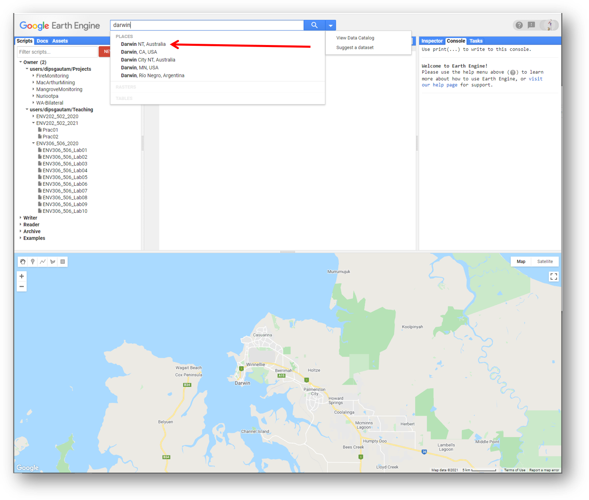


2. Use the geometry tools to make a point on Casuarina campus of Charles Darwin University (located in the suburb of Brinkin, north of Rapid Creek). Once you create the geometry point, you will see it added to your Coding panel as a variable (var) under the Imports heading.


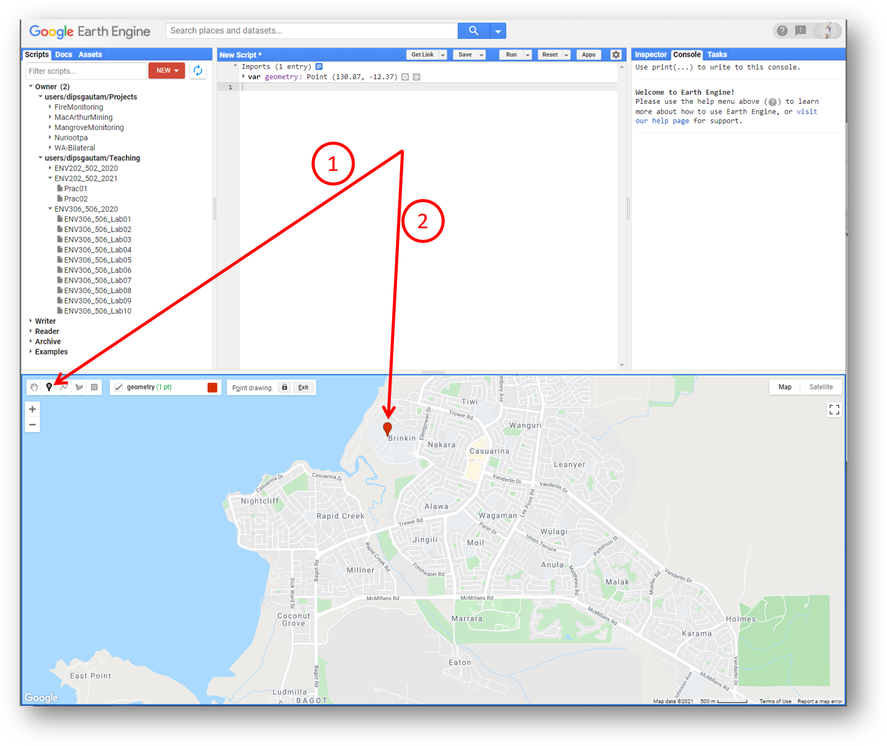

3. Rename the resulting point ‘campus’ by clicking the import name (which is called ‘geometry’ by default).

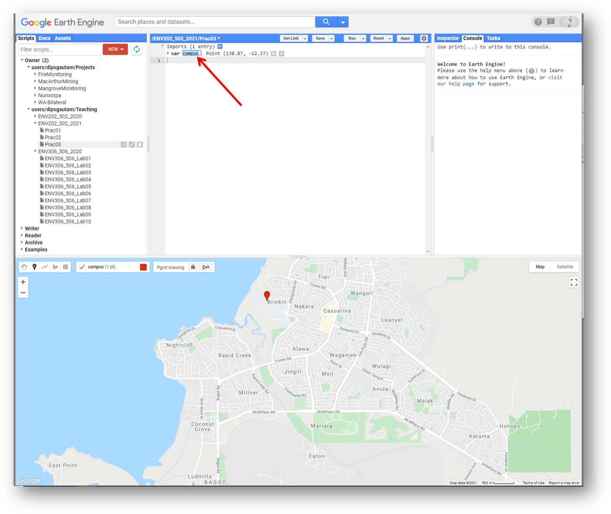


4. Search for ‘Sentinel-2’ in the search bar. In the results section you will see ‘Sentinel-2: Multi-spectral Instrument (MSI), Level-1C’ - click on it and then click the ‘Import’ button.

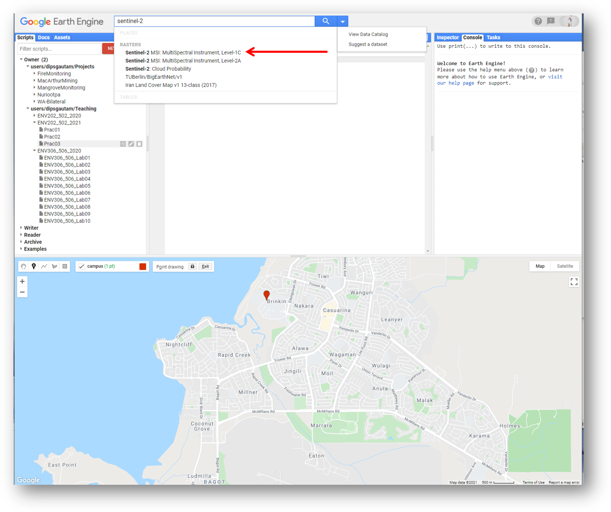


5. After clicking import, Sentinel-2 will be added to our Imports in the Coding panel as a variable. It will be listed below our campus geometry point with the default name "imageCollection". Let's rename this to “sent2” by clicking on imageCollection and typing "sent2". Note that you can rename it to any name you want. 

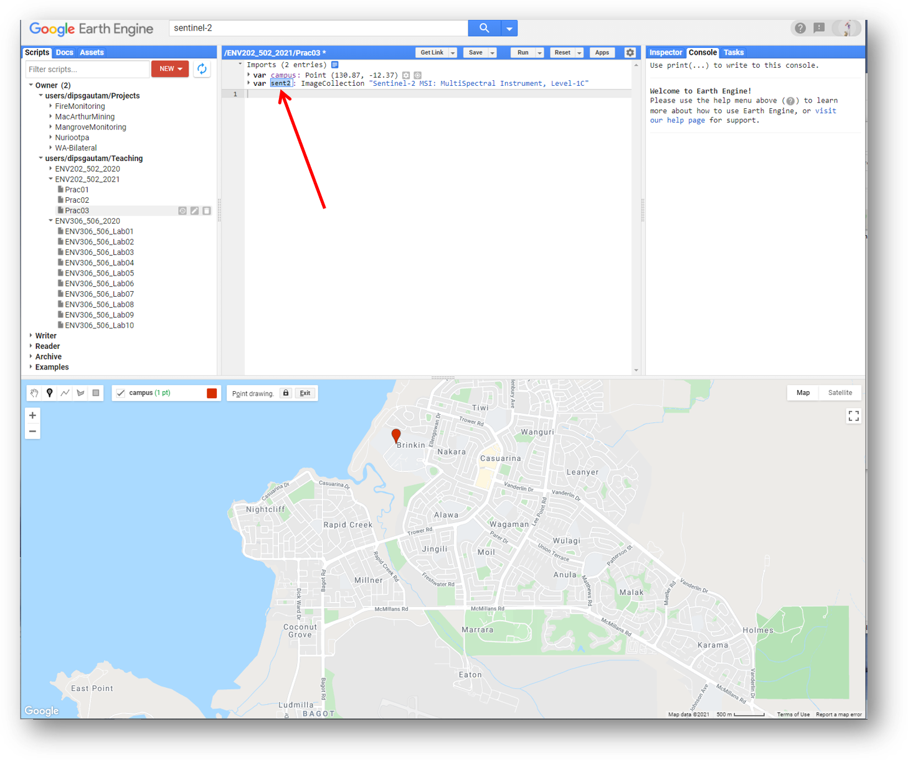

6. It is important to understand that we have now added access to the full Sentinel-2 image collection (i.e. every image that has been collected to date) to our script. For this exercise we don't want to load all these images - we want a single cloud free image over Charles Darwin University. As such, we can now filter the image collection with a few criteria, such as time of acquisition, spatial location and cloud cover.

---------

## 2. Filtering the image collection

1. To achieve this we need to use a bit of coding. In the JavaScript programming language two backslashes (//) indicate comment lines and are ignored in actual processing steps. We use // to write notes to ourselves in our code, so that we (and others who might want to use our code) can understand why we have done certain things. In the below script, note that 

```JavaScript
// Before using any new variable you need to define the variable using command "var" as below
    var anImage = sent2

    // sent2 is an image collection so lets filter the collection by the the date range we are interested in
    .filterDate("2015-07-01", "Date.now()")

    // Next we include a geographic filter to narrow the search to images at the location of our point
    .filterBounds(campus)

    // Next we will also sort the collection by a metadata property, in our case cloud cover is a very useful one
    .sort("CLOUD_COVERAGE_ASSESSMENT")
	
    // Now lets select the first image out of this collection - i.e. the most cloud free image in the date range and over the campus
    .first();  //Note that upto here was one line of script, hence, no use colon

// And let's print the image to the console.
print("A Sentinel-2 scene:", image);
```

Question: Can you figure out how we found out this this keyword "CLOUD_COVERAGE_ASSESSMENT". Are there any others?

2. You need to copy the entire piece of code above and paste it in the “New script” box of the GEE code editor. Then click the "Run" button and watch Google do its magic...... This piece of code will search the full Sentinel-2 archive, find images that are located over Darwin, sort them according to percentage cloud cover, and then return the most recent cloud free image for us. Information relating to this image will be printed to the Console, where it is listed as "A Sentinel-2 scene" with some details about that scene(COPERNICUS/S2/20160410T013712_20160410T013707_T52LGM). We know from the Image id that is was collected on the 10th April 2016.


---------
## 3. Adding image to the map view
1. Now we have refined the entire image collection to a single image called "anImage". In order to actually have a look at this image, we need to add it to our mapping environment. Before doing that however, lets define how we want to display the image. Let’s start with a true colour representation by pasting the following lines below the ones you’ve already added, and click "Run".

```JavaScript
// Define visualization parameters in a JavaScript dictionary for true colour rendering. Bands 4,3 and 2 needed for RGB.
var trueViz = {
  bands: ["B4", "B3", "B2"],
  min: 0,
  max: 3000
  };

// Add the image to the map, using the visualization parameters.
Map.addLayer(anImage, trueViz, "true-colour image");
```

2. This code specifies that for a true colour image, bands 4,3 and 2 should be used in the RGB composite. After the image appears in the map, you can zoom in and explore Darwin. We see great detail in the Sentinel-2 image, which is at 10m resolution for the selected bands. The (+) and (-) symbols in the upper left corner of the map can be used for zooming in and out (also possible with the mouse scroll wheel/trackpad). A left click with the mouse brings up the "hand" for panning to move around the image. Moving your mouse over the "Layers" button in the top right-hand corner of the map panel shows you the available layers, and lets you adjust the opacity of different layers.

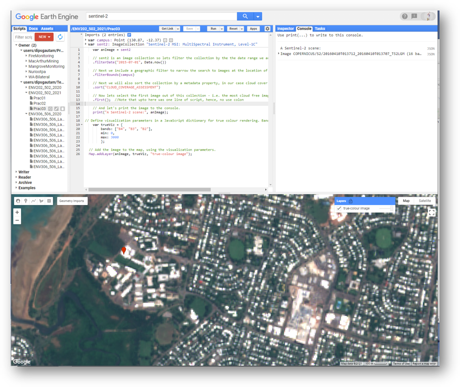

3. In order to find out more information at specific locations, we can use the Inspector tool which is located in the Console Panel - left hand tab. Click on the Inspector tab and then click on the image in the map view. Wherever you click on the image, the band values at that point will be displayed in the Inspector window. Click over some different patch types (sports fields, mangroves, ocean, beach, houses) to see how the spectral profile changes.

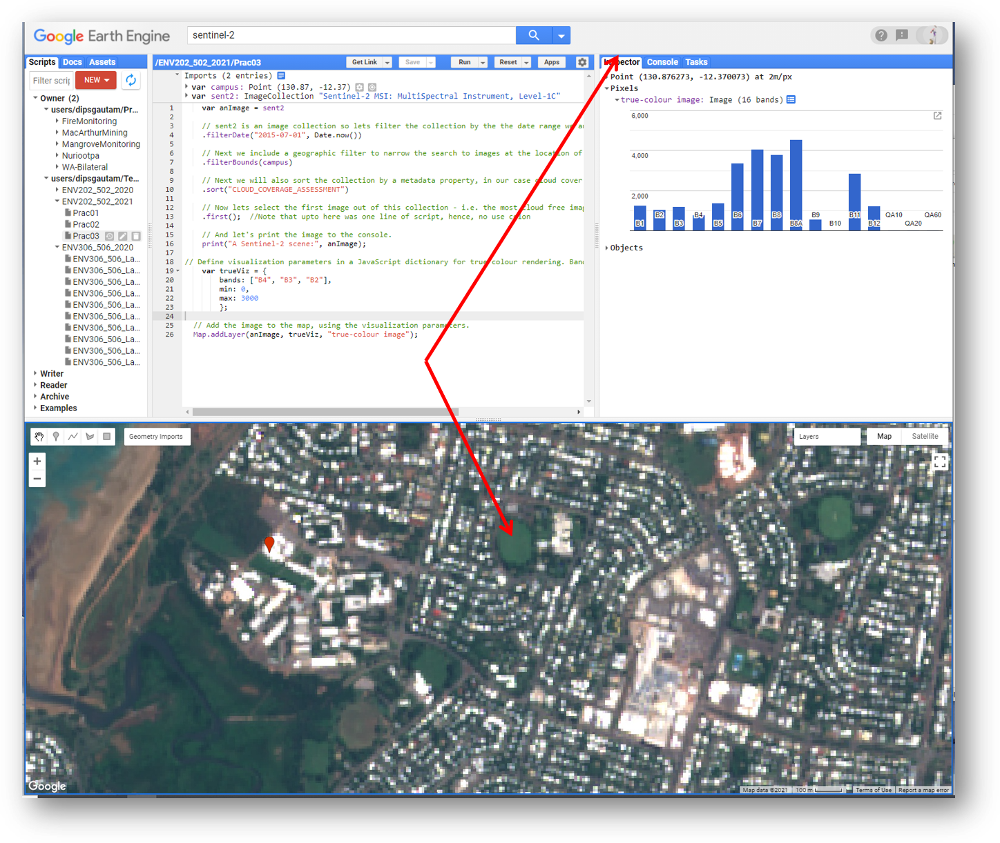

4. Now let's have a look at a false colour composite - we need to bring in the near-infrared band (band 8) for this. Paste the following lines below the ones you’ve already added, and click "Run".

```JavaScript
//Define false-colour visualization parameters.
var falseViz = {
  bands: ["B8", "B4", "B3"],
  min: 0,
  max: 3000
  };

// Add the image to the map, using the visualization parameters.
Map.addLayer(anImage, falseViz, "false-color composite");
```

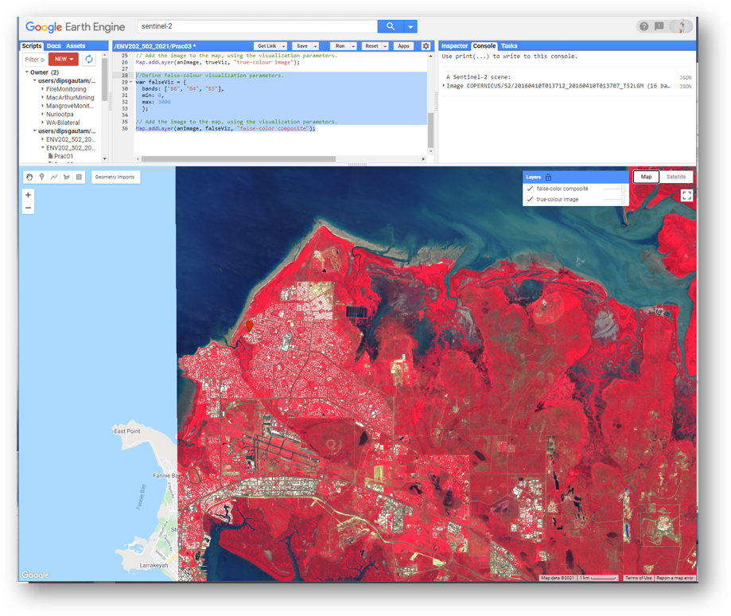

5. False-colour composites place the near infra-red band in the red channel, and we see a strong response to the chlorophyll content in green leaves. Vegetation that appears dark green in true colour, appearing bright red in the false-colour. Note the variations in red that can be seen in the vegetation bordering Rapid Creek. You will also see that "false-colour composite" has been added to the Layers tab in the map view.

---------

## 4. Calculating indices: an example of NDVI

1. Next, let's calculate the normalised-difference vegetation index (NDVI) for this image. NDVI is an index calculated from the RED and NIR bands, according to this equation:

NDVI = (NIR - RED)/(NIR + RED)

Paste the following lines below the ones you’ve already added, and click "Run". NDVI values range from 0 to 1, and the higher the value the more "vigorous" the vegetation.


```javascript
//Define variable NDVI from equation
var ndviImage = anImage.expression(
  "(NIR - RED) / (NIR + RED)",
  {
    RED: anImage.select("B4"),    //  RED
    NIR: anImage.select("B8"),    // NIR
    BLUE: anImage.select("B2")    // BLUE
  });

// Add the NDVI image to the map, using the visualization parameters.
Map.addLayer(ndviImage, {min: 0, max: 1}, "NDVI");
```

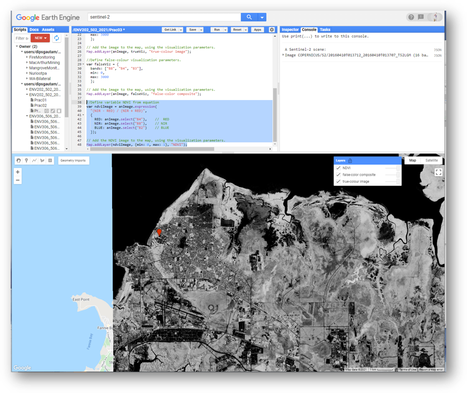

2. Explore different parts of the image and see how NDVI values vary with different substrate types.

3. Now you can adopt the code that we developed in Prac1 to add color palette to the NDVI image.

```javascript
// Add color palette to the NDVI image.
Map.addLayer(ndviImage, {min: 0, max: 1, palette: ['red','yellow','green','darkgreen']}, "NDVI-colored");
```

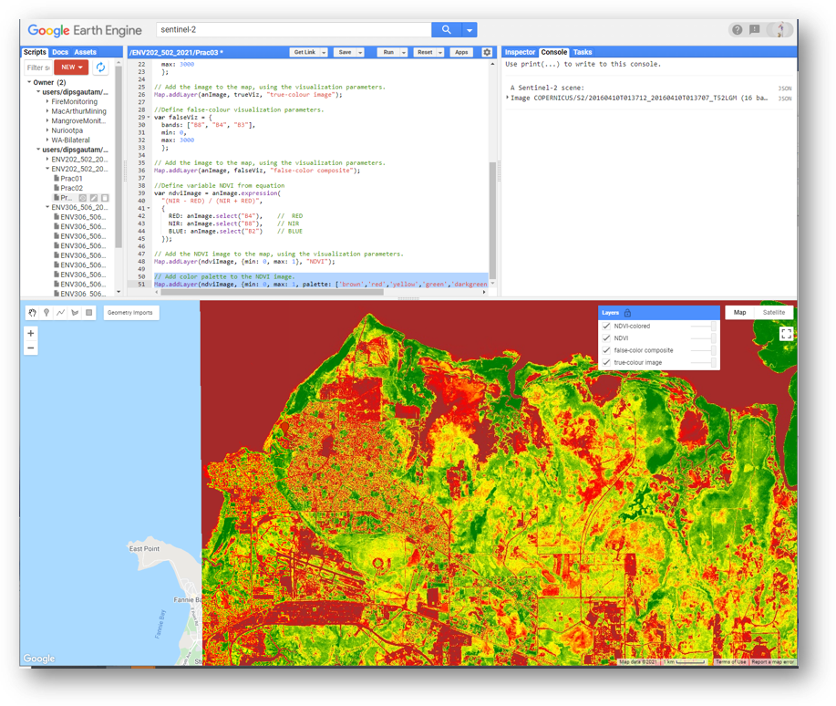

4. At this point you can just just click and drag the point you created (campus) to anywhere in the world and hit run to get all the maps that has been scripted. In the below example, I moved the point to wine-growing region of Coonawarra, SA. 

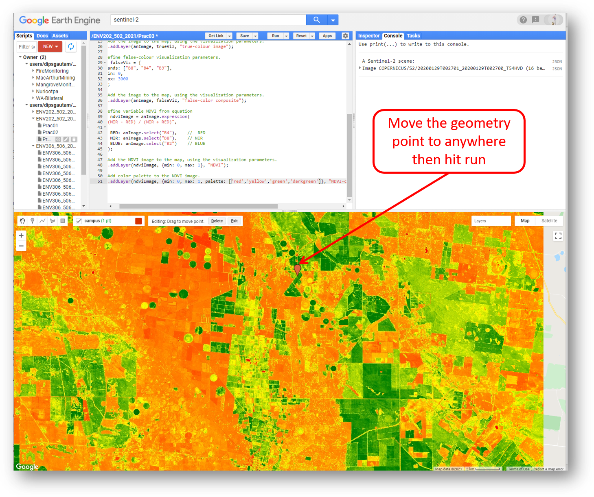


### 5. Complete script 
```JavaScript
var campus = /* color: #d63000 */ee.Geometry.Point([140.8753806158861, -37.230552670447054]);
var sent2 = ee.ImageCollection("COPERNICUS/S2");

var anImage = sent2
  // sent2 is an image collection so lets filter the collection by the the date range we are interested in
  .filterDate("2020-01-01", Date.now())

  // Next we include a geographic filter to narrow the search to images at the location of our point
  .filterBounds(campus)

  // Next we will also sort the collection by a metadata property, in our case cloud cover is a very useful one
  .sort("CLOUD_COVERAGE_ASSESSMENT")
	
  // Now lets select the first image out of this collection - i.e. the most cloud free image in the date range and over the campus
  .first();  //Note that upto here was one line of script, hence, no use colon

  // And let's print the image to the console.
  print("A Sentinel-2 scene:", anImage);
    
// Define visualization parameters in a JavaScript dictionary for true colour rendering. Bands 4,3 and 2 needed for RGB.
var trueViz = {
  bands: ["B4", "B3", "B2"],
  min: 0,
  max: 3000
  };

// Add the image to the map, using the visualization parameters.
Map.addLayer(anImage, trueViz, "true-colour image");
  
//Define false-colour visualization parameters.
var falseViz = {
  bands: ["B8", "B4", "B3"],
  min: 0,
  max: 3000
  };

// Add the image to the map, using the visualization parameters.
Map.addLayer(anImage, falseViz, "false-color composite");

//Define variable NDVI from equation
var ndviImage = anImage.expression(
  "(NIR - RED) / (NIR + RED)",
  {
    RED: anImage.select("B4"),    //  RED
    NIR: anImage.select("B8"),    // NIR
    BLUE: anImage.select("B2")    // BLUE
  });

// Add the NDVI image to the map, using the visualization parameters.
Map.addLayer(ndviImage, {min: 0, max: 1}, "NDVI");

// Add color palette to the NDVI image.
Map.addLayer(ndviImage, {min: 0, max: 1, palette: ['red','yellow','green','darkgreen']}, "NDVI-colored");
```
------
### Practice exercise

1. Search for a cloud free Sentinel-2 image from May, July and September 2018 collected over Litchfield National Park (Litchfield is located south of Darwin, near the town of Batchelor, Northern Territory, Australia).
2. Calculate NDVI for each of the scenes and load them into the map view.
3. Inspect how NDVI varies spatially across each image, and explore how patterns in NDVI vary according to time of year.
4. Search for a cloud free Landsat 8 image (USGS Landsat 8 Surface Reflectance Tier 1) from May, July and September 2018 collected over Litchfield National Park.
5. Remember that the band position of RED and NIR wavelengths might differ between different sensors. For Landsat 8, the metadata property for cloud cover is 'CLOUD_COVER'.
6. Compare NDVI values attained from the two sensors and think about why they might differ.

-------
### Thank you

I hope you found that useful. A recorded video of this tutorial can be found on my YouTube Channel's [Introduction to Remote Sensing of the Environment Playlist](https://www.youtube.com/playlist?list=PLf6lu3bePWHDi3-lrSqiyInMGQXM34TSV).

#### Kind regards, Shaun R Levick (edit Deepak Gautam)
------


### The end

