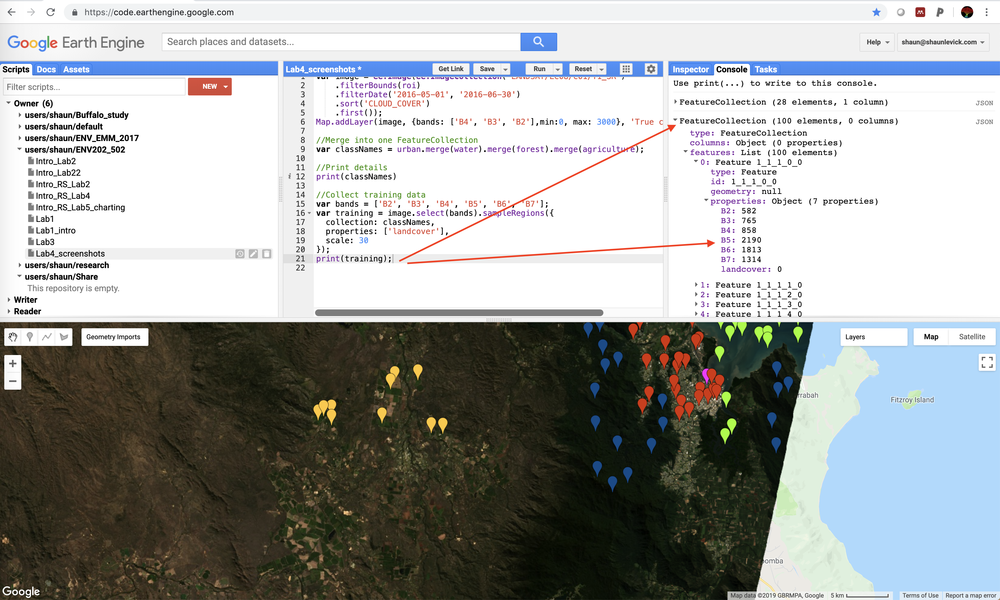

# Introductory Remote Sensing (ENV202/502)
Prac 4 - Image Classification - part 1
--------------

### Acknowledgments
- Google Earth Engine Team
- Google Earth Engine Developers group
- David Saah and Nicholas Clinton

------

### Prerequisites
-------------

Completion of this Prac exercise requires the use of the Google Chrome browser and a Google Earth Engine account. If you have not yet signed up - please do so now in a new tab: [Earth Engine account registration](https://signup.earthengine.google.com/)

Once registered you can access the Earth Engine environment here: https://code.earthengine.google.com

Google Earth Engine uses the JavaScript programming language. We will cover the very basics of this language during this course. If you would like more detail you can read through the introduction provided here: [JavaScript background](https://developers.google.com/earth-engine/tutorials/tutorial_js_01)

------------------------------------------------------------------------

### Objective


The objective of this prac is to gain understanding of the image classification process and explore ways of turning remotely sensed imagery into landcover maps.

----------

## 1. Loading up the the Landsat 8 image

1. The first step is to get a cloud free image with which to work. So far we have worked on the elevation data and the Sentinel-2 images. Todays Prac will be on Landsat 8 image. Look for USGS Landsat 8 Surface Reflectance Tier 1 imagery, import it, and rename the imageCollection to L8. Refer to previous labs if you dont know how to search for, import, and rename imageries.

2. Building on from last week, we can use the point drawing tool (teardrop icon) from the geometry tools and draw a single point in the region of interest - let's use the town of Cairns for this example.  Then 'Exit' from the drawing tools.  Note that a new variable is created in the imports section, containing the single point, imported as a Geometry.  Change the name of this import to "roi" - short for region of interest.


3. Filter the image collection spatially (using the filterBounds command), and temporally (using the filterDate command), and lastly sort the images by cloud cover (using the 'CLOUD_COVER' keyword) and extract the least cloudy scene (using the "first" command). Run the script below to extract our desired image from the Landsat 8 collection and add it to the map view as a true-colour composite:

```JavaScript
// Lets filter the image collection to get a single image
var anImage = L8
  // L8 is an image collection so lets  include a geographic filter to narrow the search to images at the location of our point
  .filterBounds(roi)
  // further filter the collection by the the date range we are interested in
  .filterDate('2016-05-01', '2016-06-30')
  // Next we will also sort the collection by a metadata property, in our case cloud cover is a very useful one
  .sort('CLOUD_COVER')
  // Now lets select the first image out of this collection - i.e. the most cloud free image in the date range and over the region of interest
  .first();

// lets display the filtered cloudfree image to our mapping layer using true color composite
Map.addLayer(anImage, {bands: ['B4', 'B3', 'B2'],min:0, max: 3000}, 'True colour image');
```

Question: In last prac we used "CLOUD_COVERAGE_ASSESSMENT" to sort the images by cloud cover, however, in this prac "CLOUD_COVER" is used. Can you find out why?


4. Have a look around the scene and familiarise yourself with the landscape. You'll notice the image is quite dark image - we can adjust the brightness/contrast using the settings wheels for the layer we created in the Layers tab. Slide the Gamma adjuster slightly to the right (from 1.0 to 1.4) to increase the brightness of the scene. Alternatively, in the previous line of script, you can encode the gamma value in the visualisation parameter as: "{bands: ['B4', 'B3', 'B2'],min:0, max: 3000, gamma:1.4}" 


## 2. Gathering training data for classification

1. The first step in classifying our image is to collect some training data to teach the classifier what each landcover looks like.  We want to collect representative samples of reflectance spectra for each landcover class of interest. First lets gather some sample points to teach classifier what urban area is goig to look like. Hover on the 'Geometry Imports' box next to the geometry drawing tools and click '+ new layer.'


3. The new layer will be imported to the "Geometry Import" box as well as to the import section of you script. Rename the new layer to 'urban'. Notice that the renameing will change the name of the layer in the "Geometry Imports" box.


4. Now, locate points in the map that represents the urban or built up areas (buildings, roads, parking lots, etc.). Clicking on the urban area will collect the training data for the urban. Sample minimum of 25 points. For robust classification make sure you are sampling from different types of urban areas (not just one).  


5. Next you need to configure the urban geometry import (cog-wheel, top of the script in imports section) as follows.  Click the cog-wheel icon to configure it, change 'Import as'  from 'Geometry' to 'FeatureCollection'.  Use 'Add property' landcover and set its value to 0.  (Subsequent classes will be 1, 2, 3 etc.). You can also change the color of the 'teardrops', here if you like. When finished, click 'OK'.


6. Repeat the steps 1-5 for each land cover class that you wish to include in your classification. Add 'water', 'forest', 'agriculture' , and 'bareland' next - collect >25 points for each class. Use the cog-wheel to configure the geometries - change the type to FeatureCollection and set the property name to landcover with values of 1, 2, 3, and 4 for the different classes.


7. Now we have five classes defined (urban, water, forest, agriculture, bareland), but before we can use them to collect training data we need to merge the 5 landcover features into a single collection, called a FeatureCollection. Run the following line to merge the geometries into a single FeatureCollection:

```javascript
// Merge the 5 landcover class features into a single featureCollection
var LandCoverClasses = urban.merge(water).merge(forest).merge(agriculture).merge(bareland);
```

8. Print the feature collection and inspect the features.

```javascript
// Print the land cover feature collection
print('The land cover feature collection is: ',LandCoverClasses);
```


## 3. Creating the training data

1. Now we can use the FeatureCollection we created to drill through the image and extract the reflectance data for each point, from every band. We create training data by overlaying the training points on the image.  This will add new properties to the feature collection that represent image band values at each point:

```javascript
// add new properties to the "LandCoverClasses" - the new property is the reflectance data from the above bands
LandCoverClasses = anImage.select(bands).sampleRegions({ // sample the reflectance from selected bands
  collection: LandCoverClasses, // save the reflectance to the LandCoverClasses
  properties: ['landcover'],
  scale: 30
});

// print our training dataset
print('The training dataset is: ', LandCoverClasses);
```

2. After running the script the training data will be printed to the console. You will notice that the 'properties' information has now changed, and in addition to the landcover class, for each point there is now a corresponding reflectance value for each of the selected band of the image.




## 4. Train the classifier and run the classification

1. Now we can train the classifier algorithm by using our examples of what different landcover class look like from a multi-spectral perspective.

```javascript
// train our classifier. Here we used cart classifier.
var classifier = ee.Classifier.smileCart().train({
  features: LandCoverClasses,
  classProperty: 'landcover',
  inputProperties: bands
});

```

2. The next step is then to apply this knowledge from our training to the rest of the image (i.e. the pixels that we did not use for training) - using what was learnt from our supervised collection to inform decisions about which class other pixels should belong to.

```javascript
//Run the classification for the entire scene
var classified = anImage.select(bands).classify(classifier);
```

3. Display the results using the mapping function below. You may need to adjust  the colours, but if the training data have been created with urban=0, water=1, forest=2, and agriculture=3 - then the result will be rendered with those classes as yellow, blue and green, respectively.


```javascript
//Display classified map. The color scheme defined below is set to according to the numbering of the class. e.g. class0 was urban which is set to red
Map.centerObject(roi, 10);
Map.addLayer(classified, {min: 0, max: 4, palette: ['red', 'blue', 'darkgreen','lightgreen', 'gray']}, 'Classified map');
```

4. From the 'Geometry Import' box, untick all the geometries for better visualisation.


5. Congratulations - your first landcover classification! Zoom in and explore the results of your classification. 
- Are you happy with the classification?
- How could it be improved?
- Try adding in some extra classes for landcover categories that show signs of confusion

We will look at how to refine this and discuss limitations and avenues for improvement next week.

### 5. Complete script (excluding the ImageCollection, roi, and landcover features)
```JavaScript
var L8 = ee.ImageCollection("LANDSAT/LC08/C01/T1_SR"),
    roi = 
    /* color: #d63000 */
    /* shown: false */
    ee.Geometry.Point([145.75745636657334, -16.917948937296533]),
    urban = 
    /* color: #ff3e13 */
    /* shown: false */
    ee.FeatureCollection(
        [ee.Feature(
            ee.Geometry.Point([145.75277446037038, -16.933283862784624]),
            {
              "landcover": 0,
              "system:index": "0"
            }),
        ee.Feature(
            ee.Geometry.Point([145.75747369056447, -16.930615286403878]),
            {
              "landcover": 0,
              "system:index": "1"
            }),
        ee.Feature(
            ee.Geometry.Point([145.76855399340258, -16.9176050688006]),
            {
              "landcover": 0,
              "system:index": "2"
            }),
        ee.Feature(
            ee.Geometry.Point([145.7660541746007, -16.914659123571234]),
            {
              "landcover": 0,
              "system:index": "3"
            }),
        ee.Feature(
            ee.Geometry.Point([145.74401040737976, -16.914396189198875]),
            {
              "landcover": 0,
              "system:index": "4"
            }),
        ee.Feature(
            ee.Geometry.Point([145.777913529328, -16.927165058250246]),
            {
              "landcover": 0,
              "system:index": "5"
            }),
        ee.Feature(
            ee.Geometry.Point([145.77345033352722, -16.93439078696521]),
            {
              "landcover": 0,
              "system:index": "6"
            }),
        ee.Feature(
            ee.Geometry.Point([145.7398047036444, -16.944900442516403]),
            {
              "landcover": 0,
              "system:index": "7"
            }),
        ee.Feature(
            ee.Geometry.Point([145.7262434548651, -16.92650816006747]),
            {
              "landcover": 0,
              "system:index": "8"
            }),
        ee.Feature(
            ee.Geometry.Point([145.73422570889343, -16.902283439669954]),
            {
              "landcover": 0,
              "system:index": "9"
            }),
        ee.Feature(
            ee.Geometry.Point([145.71293969815125, -16.900476725581942]),
            {
              "landcover": 0,
              "system:index": "10"
            }),
        ee.Feature(
            ee.Geometry.Point([145.6966318673407, -16.900312477988304]),
            {
              "landcover": 0,
              "system:index": "11"
            }),
        ee.Feature(
            ee.Geometry.Point([145.69422860806336, -16.88914330607619]),
            {
              "landcover": 0,
              "system:index": "12"
            }),
        ee.Feature(
            ee.Geometry.Point([145.73096414273132, -17.00901302647807]),
            {
              "landcover": 0,
              "system:index": "13"
            }),
        ee.Feature(
            ee.Geometry.Point([145.73199411099304, -16.995880350685038]),
            {
              "landcover": 0,
              "system:index": "14"
            }),
        ee.Feature(
            ee.Geometry.Point([145.73268075650086, -16.958118784636838]),
            {
              "landcover": 0,
              "system:index": "15"
            }),
        ee.Feature(
            ee.Geometry.Point([145.75362344448914, -16.876330794821275]),
            {
              "landcover": 0,
              "system:index": "16"
            }),
        ee.Feature(
            ee.Geometry.Point([145.691825348786, -16.833616149234178]),
            {
              "landcover": 0,
              "system:index": "17"
            }),
        ee.Feature(
            ee.Geometry.Point([145.7398905343329, -16.84281704177398]),
            {
              "landcover": 0,
              "system:index": "18"
            }),
        ee.Feature(
            ee.Geometry.Point([145.7292475289618, -16.93480133140421]),
            {
              "landcover": 0,
              "system:index": "19"
            }),
        ee.Feature(
            ee.Geometry.Point([145.7680430001532, -16.937428794602656]),
            {
              "landcover": 0,
              "system:index": "20"
            }),
        ee.Feature(
            ee.Geometry.Point([145.7354273385321, -17.00901302647807]),
            {
              "landcover": 0,
              "system:index": "21"
            }),
        ee.Feature(
            ee.Geometry.Point([145.7405771798407, -16.931188509602574]),
            {
              "landcover": 0,
              "system:index": "22"
            }),
        ee.Feature(
            ee.Geometry.Point([145.74074884121765, -16.90495755005416]),
            {
              "landcover": 0,
              "system:index": "23"
            }),
        ee.Feature(
            ee.Geometry.Point([145.71671624844421, -16.87982660229499]),
            {
              "landcover": 0,
              "system:index": "24"
            }),
        ee.Feature(
            ee.Geometry.Point([145.69319863980164, -16.905450280266905]),
            {
              "landcover": 0,
              "system:index": "25"
            })]),
    water = 
    /* color: #0725ff */
    /* shown: false */
    ee.FeatureCollection(
        [ee.Feature(
            ee.Geometry.Point([145.318290192536, -16.800305386816003]),
            {
              "landcover": 1,
              "system:index": "0"
            }),
        ee.Feature(
            ee.Geometry.Point([145.3450693673407, -16.841055968042152]),
            {
              "landcover": 1,
              "system:index": "1"
            }),
        ee.Feature(
            ee.Geometry.Point([145.73645730679382, -16.791759799471993]),
            {
              "landcover": 1,
              "system:index": "2"
            }),
        ee.Feature(
            ee.Geometry.Point([145.7728495187079, -16.83645553486973]),
            {
              "landcover": 1,
              "system:index": "3"
            }),
        ee.Feature(
            ee.Geometry.Point([145.83052774136414, -16.818709960058758]),
            {
              "landcover": 1,
              "system:index": "4"
            }),
        ee.Feature(
            ee.Geometry.Point([145.85181375210632, -16.766120730348447]),
            {
              "landcover": 1,
              "system:index": "5"
            }),
        ee.Feature(
            ee.Geometry.Point([145.7948221749579, -16.710228736336795]),
            {
              "landcover": 1,
              "system:index": "6"
            }),
        ee.Feature(
            ee.Geometry.Point([145.30318399136414, -16.797676016302475]),
            {
              "landcover": 1,
              "system:index": "7"
            }),
        ee.Feature(
            ee.Geometry.Point([145.50175622371393, -17.034267945140662]),
            {
              "landcover": 1,
              "system:index": "8"
            }),
        ee.Feature(
            ee.Geometry.Point([145.781149419583, -16.985695488045607]),
            {
              "landcover": 1,
              "system:index": "9"
            }),
        ee.Feature(
            ee.Geometry.Point([145.78818753603807, -16.97403883468636]),
            {
              "landcover": 1,
              "system:index": "10"
            }),
        ee.Feature(
            ee.Geometry.Point([145.7745404565703, -16.97264327131837]),
            {
              "landcover": 1,
              "system:index": "11"
            }),
        ee.Feature(
            ee.Geometry.Point([145.79642728213182, -16.993657715162662]),
            {
              "landcover": 1,
              "system:index": "12"
            }),
        ee.Feature(
            ee.Geometry.Point([145.77428296450486, -16.990620616867393]),
            {
              "landcover": 1,
              "system:index": "13"
            }),
        ee.Feature(
            ee.Geometry.Point([145.77514689679074, -16.904822894411975]),
            {
              "landcover": 1,
              "system:index": "14"
            }),
        ee.Feature(
            ee.Geometry.Point([145.79677623028684, -16.901209497590212]),
            {
              "landcover": 1,
              "system:index": "15"
            }),
        ee.Feature(
            ee.Geometry.Point([145.73806803936887, -16.811509407657507]),
            {
              "landcover": 1,
              "system:index": "16"
            }),
        ee.Feature(
            ee.Geometry.Point([145.755920822572, -16.689541281844672]),
            {
              "landcover": 1,
              "system:index": "17"
            }),
        ee.Feature(
            ee.Geometry.Point([145.87368052716184, -16.685923784748375]),
            {
              "landcover": 1,
              "system:index": "18"
            }),
        ee.Feature(
            ee.Geometry.Point([145.7665638279431, -16.74708315291545]),
            {
              "landcover": 1,
              "system:index": "19"
            }),
        ee.Feature(
            ee.Geometry.Point([145.70476573223996, -16.704339420403745]),
            {
              "landcover": 1,
              "system:index": "20"
            }),
        ee.Feature(
            ee.Geometry.Point([145.65532725567746, -16.676386418813383]),
            {
              "landcover": 1,
              "system:index": "21"
            }),
        ee.Feature(
            ee.Geometry.Point([145.63404124493528, -16.677044183460115]),
            {
              "landcover": 1,
              "system:index": "22"
            }),
        ee.Feature(
            ee.Geometry.Point([145.59867900128293, -16.611585528558066]),
            {
              "landcover": 1,
              "system:index": "23"
            }),
        ee.Feature(
            ee.Geometry.Point([145.72605174298215, -16.658954831667614]),
            {
              "landcover": 1,
              "system:index": "24"
            }),
        ee.Feature(
            ee.Geometry.Point([145.8426564396519, -16.845557624094237]),
            {
              "landcover": 1,
              "system:index": "25"
            })]),
    forest = 
    /* color: #0bc233 */
    /* shown: false */
    ee.FeatureCollection(
        [ee.Feature(
            ee.Geometry.Point([145.48882314894743, -16.63350212613973]),
            {
              "landcover": 2,
              "system:index": "0"
            }),
        ee.Feature(
            ee.Geometry.Point([145.28488943312712, -16.540055752606744]),
            {
              "landcover": 2,
              "system:index": "1"
            }),
        ee.Feature(
            ee.Geometry.Point([145.28832266066618, -16.6071837984113]),
            {
              "landcover": 2,
              "system:index": "2"
            }),
        ee.Feature(
            ee.Geometry.Point([145.29175588820524, -16.565725121789626]),
            {
              "landcover": 2,
              "system:index": "3"
            }),
        ee.Feature(
            ee.Geometry.Point([145.58770010207243, -16.724272605266858]),
            {
              "landcover": 2,
              "system:index": "4"
            }),
        ee.Feature(
            ee.Geometry.Point([145.45792410109587, -16.712435422392154]),
            {
              "landcover": 2,
              "system:index": "5"
            }),
        ee.Feature(
            ee.Geometry.Point([145.62271902297087, -16.753204846919207]),
            {
              "landcover": 2,
              "system:index": "6"
            }),
        ee.Feature(
            ee.Geometry.Point([145.66597768996306, -16.842603945357485]),
            {
              "landcover": 2,
              "system:index": "7"
            }),
        ee.Feature(
            ee.Geometry.Point([145.65430471633024, -16.994354107679666]),
            {
              "landcover": 2,
              "system:index": "8"
            }),
        ee.Feature(
            ee.Geometry.Point([145.64263174269743, -17.03768879581005]),
            {
              "landcover": 2,
              "system:index": "9"
            }),
        ee.Feature(
            ee.Geometry.Point([145.6131059858615, -17.086920569292843]),
            {
              "landcover": 2,
              "system:index": "10"
            }),
        ee.Feature(
            ee.Geometry.Point([145.68657705519743, -17.037032284490518]),
            {
              "landcover": 2,
              "system:index": "11"
            }),
        ee.Feature(
            ee.Geometry.Point([145.63713857863493, -16.955607040535288]),
            {
              "landcover": 2,
              "system:index": "12"
            }),
        ee.Feature(
            ee.Geometry.Point([145.68863699172087, -17.254211162398782]),
            {
              "landcover": 2,
              "system:index": "13"
            }),
        ee.Feature(
            ee.Geometry.Point([145.77996084425993, -17.194528708801805]),
            {
              "landcover": 2,
              "system:index": "14"
            }),
        ee.Feature(
            ee.Geometry.Point([145.73601553175993, -17.347303441313464]),
            {
              "landcover": 2,
              "system:index": "15"
            }),
        ee.Feature(
            ee.Geometry.Point([145.7016832563693, -17.457379783414943]),
            {
              "landcover": 2,
              "system:index": "16"
            }),
        ee.Feature(
            ee.Geometry.Point([145.67284414504118, -17.60077230851093]),
            {
              "landcover": 2,
              "system:index": "17"
            }),
        ee.Feature(
            ee.Geometry.Point([145.62889883254118, -16.970056034593576]),
            {
              "landcover": 2,
              "system:index": "18"
            }),
        ee.Feature(
            ee.Geometry.Point([145.2842027876193, -16.62165932523555]),
            {
              "landcover": 2,
              "system:index": "19"
            }),
        ee.Feature(
            ee.Geometry.Point([145.46753713820524, -16.599945625883922]),
            {
              "landcover": 2,
              "system:index": "20"
            }),
        ee.Feature(
            ee.Geometry.Point([145.52658865187712, -16.685470209784583]),
            {
              "landcover": 2,
              "system:index": "21"
            }),
        ee.Feature(
            ee.Geometry.Point([145.52246877883024, -16.642712687976438]),
            {
              "landcover": 2,
              "system:index": "22"
            }),
        ee.Feature(
            ee.Geometry.Point([145.65248776999817, -17.090434486063756]),
            {
              "landcover": 2,
              "system:index": "23"
            }),
        ee.Feature(
            ee.Geometry.Point([145.60304929343567, -17.181641250909585]),
            {
              "landcover": 2,
              "system:index": "24"
            }),
        ee.Feature(
            ee.Geometry.Point([145.6432590142748, -17.13433276908912]),
            {
              "landcover": 2,
              "system:index": "25"
            })]),
    agriculture = 
    /* color: #a4ffaf */
    /* shown: false */
    ee.FeatureCollection(
        [ee.Feature(
            ee.Geometry.Point([145.5487635383992, -17.349369484548333]),
            {
              "landcover": 3,
              "system:index": "0"
            }),
        ee.Feature(
            ee.Geometry.Point([145.56764628986403, -17.370668943018618]),
            {
              "landcover": 3,
              "system:index": "1"
            }),
        ee.Feature(
            ee.Geometry.Point([145.5226710091023, -17.390000153458075]),
            {
              "landcover": 3,
              "system:index": "2"
            }),
        ee.Feature(
            ee.Geometry.Point([145.57004954914137, -17.42505323806428]),
            {
              "landcover": 3,
              "system:index": "3"
            }),
        ee.Feature(
            ee.Geometry.Point([145.65622356037184, -17.352974182270714]),
            {
              "landcover": 3,
              "system:index": "4"
            }),
        ee.Feature(
            ee.Geometry.Point([145.5872156868367, -17.296601717052948]),
            {
              "landcover": 3,
              "system:index": "5"
            }),
        ee.Feature(
            ee.Geometry.Point([145.53674724201247, -17.232342268182787]),
            {
              "landcover": 3,
              "system:index": "6"
            }),
        ee.Feature(
            ee.Geometry.Point([145.50447490314528, -17.21561802805]),
            {
              "landcover": 3,
              "system:index": "7"
            }),
        ee.Feature(
            ee.Geometry.Point([145.45915629962965, -17.23594925878219]),
            {
              "landcover": 3,
              "system:index": "8"
            }),
        ee.Feature(
            ee.Geometry.Point([145.47563579181715, -17.15461093119271]),
            {
              "landcover": 3,
              "system:index": "9"
            }),
        ee.Feature(
            ee.Geometry.Point([145.40216472248122, -17.107037718614773]),
            {
              "landcover": 3,
              "system:index": "10"
            }),
        ee.Feature(
            ee.Geometry.Point([145.35444285968825, -17.20807522866128]),
            {
              "landcover": 3,
              "system:index": "11"
            }),
        ee.Feature(
            ee.Geometry.Point([145.3403666267781, -17.191020809593883]),
            {
              "landcover": 3,
              "system:index": "12"
            }),
        ee.Feature(
            ee.Geometry.Point([145.32011058429762, -17.0673293838898]),
            {
              "landcover": 3,
              "system:index": "13"
            }),
        ee.Feature(
            ee.Geometry.Point([145.27719524005934, -17.112615897520893]),
            {
              "landcover": 3,
              "system:index": "14"
            }),
        ee.Feature(
            ee.Geometry.Point([145.28886821369215, -17.04894911114508]),
            {
              "landcover": 3,
              "system:index": "15"
            }),
        ee.Feature(
            ee.Geometry.Point([145.34482982257887, -17.069298591498445]),
            {
              "landcover": 3,
              "system:index": "16"
            }),
        ee.Feature(
            ee.Geometry.Point([145.29848125080153, -17.08045704201885]),
            {
              "landcover": 3,
              "system:index": "17"
            }),
        ee.Feature(
            ee.Geometry.Point([145.4121210823445, -16.925491959844482]),
            {
              "landcover": 3,
              "system:index": "18"
            }),
        ee.Feature(
            ee.Geometry.Point([145.3959849129109, -16.957349052205473]),
            {
              "landcover": 3,
              "system:index": "19"
            }),
        ee.Feature(
            ee.Geometry.Point([145.32560374836012, -16.9537366635462]),
            {
              "landcover": 3,
              "system:index": "20"
            }),
        ee.Feature(
            ee.Geometry.Point([145.27170207599684, -17.01677928347215]),
            {
              "landcover": 3,
              "system:index": "21"
            }),
        ee.Feature(
            ee.Geometry.Point([145.4069712410359, -17.025314674938528]),
            {
              "landcover": 3,
              "system:index": "22"
            }),
        ee.Feature(
            ee.Geometry.Point([145.4622462044148, -17.064375533516728]),
            {
              "landcover": 3,
              "system:index": "23"
            }),
        ee.Feature(
            ee.Geometry.Point([145.51855113605544, -17.03056703002595]),
            {
              "landcover": 3,
              "system:index": "24"
            }),
        ee.Feature(
            ee.Geometry.Point([145.527477527657, -17.010213332900925]),
            {
              "landcover": 3,
              "system:index": "25"
            })]),
    bareland = 
    /* color: #949688 */
    /* shown: false */
    ee.FeatureCollection(
        [ee.Feature(
            ee.Geometry.Point([145.07561780761063, -16.913009294504]),
            {
              "landcover": 4,
              "system:index": "0"
            }),
        ee.Feature(
            ee.Geometry.Point([144.8922834570247, -16.907096684061447]),
            {
              "landcover": 4,
              "system:index": "1"
            }),
        ee.Feature(
            ee.Geometry.Point([144.5413007553106, -16.66829574506522]),
            {
              "landcover": 4,
              "system:index": "2"
            }),
        ee.Feature(
            ee.Geometry.Point([144.5639600570684, -16.688028535070178]),
            {
              "landcover": 4,
              "system:index": "3"
            }),
        ee.Feature(
            ee.Geometry.Point([144.68068979339654, -16.634087422902642]),
            {
              "landcover": 4,
              "system:index": "4"
            }),
        ee.Feature(
            ee.Geometry.Point([144.18699167327935, -17.134098418741345]),
            {
              "landcover": 4,
              "system:index": "5"
            }),
        ee.Feature(
            ee.Geometry.Point([144.36277292327935, -17.392449065670707]),
            {
              "landcover": 4,
              "system:index": "6"
            }),
        ee.Feature(
            ee.Geometry.Point([144.43418405609185, -17.182648702574554]),
            {
              "landcover": 4,
              "system:index": "7"
            }),
        ee.Feature(
            ee.Geometry.Point([144.16089914398248, -17.858388806701306]),
            {
              "landcover": 4,
              "system:index": "8"
            }),
        ee.Feature(
            ee.Geometry.Point([145.04804514007623, -17.96815311898547]),
            {
              "landcover": 4,
              "system:index": "9"
            }),
        ee.Feature(
            ee.Geometry.Point([145.1180829818731, -17.004131307477248]),
            {
              "landcover": 4,
              "system:index": "10"
            }),
        ee.Feature(
            ee.Geometry.Point([145.2499189193731, -16.791263526821727]),
            {
              "landcover": 4,
              "system:index": "11"
            }),
        ee.Feature(
            ee.Geometry.Point([145.17164133148248, -16.583421585789143]),
            {
              "landcover": 4,
              "system:index": "12"
            }),
        ee.Feature(
            ee.Geometry.Point([144.43281076507623, -16.551830932238055]),
            {
              "landcover": 4,
              "system:index": "13"
            }),
        ee.Feature(
            ee.Geometry.Point([144.4479169662481, -16.6005310249571]),
            {
              "landcover": 4,
              "system:index": "14"
            }),
        ee.Feature(
            ee.Geometry.Point([144.6786298568731, -17.609862858919133]),
            {
              "landcover": 4,
              "system:index": "15"
            }),
        ee.Feature(
            ee.Geometry.Point([144.61683176116998, -17.612480713298197]),
            {
              "landcover": 4,
              "system:index": "16"
            }),
        ee.Feature(
            ee.Geometry.Point([144.40259836273248, -18.00864417932427]),
            {
              "landcover": 4,
              "system:index": "17"
            }),
        ee.Feature(
            ee.Geometry.Point([145.12494943695123, -18.09612532045744]),
            {
              "landcover": 4,
              "system:index": "18"
            }),
        ee.Feature(
            ee.Geometry.Point([145.34055612640435, -18.163338642565602]),
            {
              "landcover": 4,
              "system:index": "19"
            }),
        ee.Feature(
            ee.Geometry.Point([145.27532480316216, -17.72370436243093]),
            {
              "landcover": 4,
              "system:index": "20"
            }),
        ee.Feature(
            ee.Geometry.Point([144.85029123382623, -17.828322455066186]),
            {
              "landcover": 4,
              "system:index": "21"
            }),
        ee.Feature(
            ee.Geometry.Point([144.66970346527154, -17.71716370012]),
            {
              "landcover": 4,
              "system:index": "22"
            }),
        ee.Feature(
            ee.Geometry.Point([144.64189432220513, -17.434380376018915]),
            {
              "landcover": 4,
              "system:index": "23"
            }),
        ee.Feature(
            ee.Geometry.Point([144.67519662933404, -17.338382803867518]),
            {
              "landcover": 4,
              "system:index": "24"
            }),
        ee.Feature(
            ee.Geometry.Point([144.44963358001763, -17.196752145368848]),
            {
              "landcover": 4,
              "system:index": "25"
            })]);
// Lets filter the image collection to get a single image
var anImage = L8
  // L8 is an image collection so lets  include a geographic filter to narrow the search to images at the location of our point
  .filterBounds(roi)
  // further filter the collection by the the date range we are interested in
  .filterDate('2016-05-01', '2016-06-30')
  // Next we will also sort the collection by a metadata property, in our case cloud cover is a very useful one
  .sort('CLOUD_COVER')
  // Now lets select the first image out of this collection - i.e. the most cloud free image in the date range and over the region of interest
  .first();

// lets display the filtered cloudfree image to our mapping layer using true color composite
Map.addLayer(anImage, {bands: ['B4', 'B3', 'B2'],min:0, max: 3000, gamma:1.4}, 'True colour image');

// Merge the 5 landcover class features into a single featureCollection
var LandCoverClasses = urban.merge(water).merge(forest).merge(agriculture).merge(bareland);

// Print the land cover feature collection
print('The land cover feature collection is: ',LandCoverClasses);

// These will be the bands whose reflectance data will be extracted from the image for training purpose
var bands = ['B2', 'B3', 'B4', 'B5', 'B6', 'B7'];

// add new properties to the "LandCoverClasses" - the new property is the reflectance data from the above bands
LandCoverClasses = anImage.select(bands).sampleRegions({ // sample the reflectance from selected bands
  collection: LandCoverClasses, // save the reflectance to the LandCoverClasses
  properties: ['landcover'],
  scale: 30
});

// print our training dataset
print('The training dataset is: ', LandCoverClasses);

// train our classifier. Here we used cart classifier.
var classifier = ee.Classifier.smileCart().train({
  features: LandCoverClasses,
  classProperty: 'landcover',
  inputProperties: bands
});

//Run the classification for the entire scene
var classified = anImage.select(bands).classify(classifier);


//Display classified map. The color scheme defined below is set to according to the numbering of the class. e.g. class0 was urban which is set to red
Map.centerObject(roi, 10);
Map.addLayer(classified, {min: 0, max: 4, palette: ['red', 'blue', 'darkgreen','lightgreen', 'gray']}, 'Classified map');


```
-------
### Thank you

I hope you found that useful. A recorded video of this tutorial can be found on my YouTube Channel's [Introduction to Remote Sensing of the Environment Playlist](https://www.youtube.com/playlist?list=PLf6lu3bePWHDi3-lrSqiyInMGQXM34TSV).

#### Kind regards, Shaun R Levick (edit Deepak Gautam)
------
