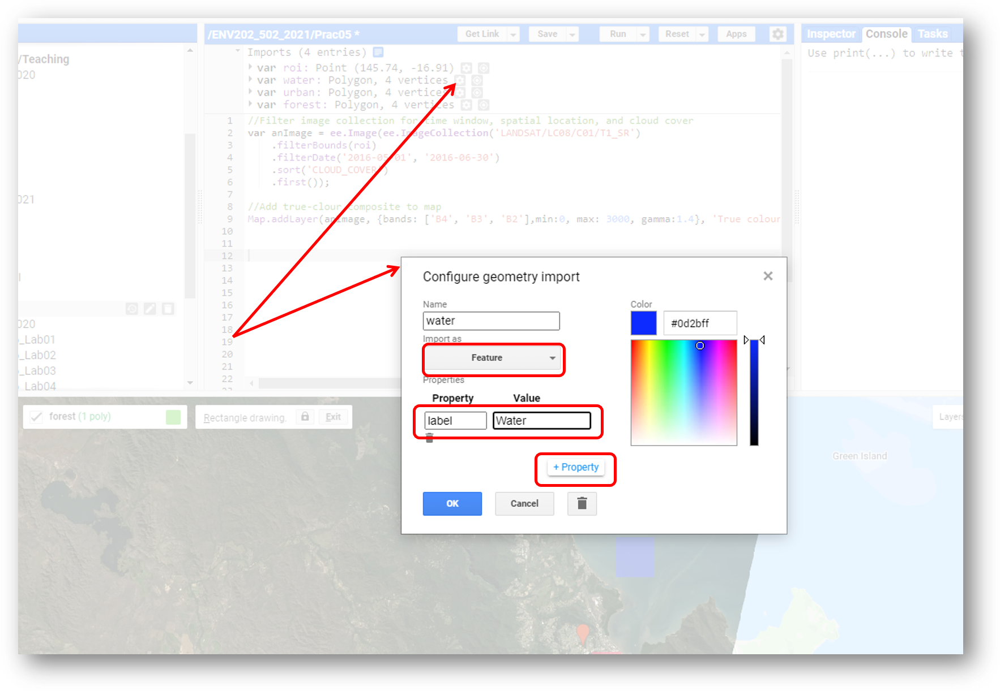
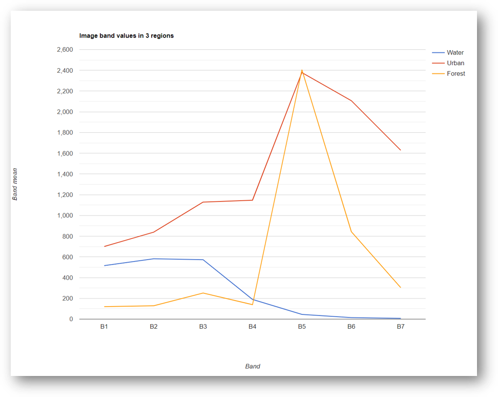

# Introductory Remote Sensing (ENV202/502)
Lab 5 - Plotting spectral response curves
--------------

### Acknowledgments
- Google Earth Engine Team
- Google Earth Engine Developers group

------

### Prerequisites
-------------

Completion of this Prac exercise requires the use of the Google Chrome browser and a Google Earth Engine account. If you have not yet signed up - please do so now in a new tab: [Earth Engine account registration](https://signup.earthengine.google.com/)

Once registered you can access the Earth Engine environment here: https://code.earthengine.google.com

Google Earth Engine uses the JavaScript programming language. We will cover the very basics of this language during this course. If you would like more detail you can read through the introduction provided here: [JavaScript background](https://developers.google.com/earth-engine/tutorials/tutorial_js_01)

------------------------------------------------------------------------

### Objective


The objective of this lab is to further your understanding of spectral responses and develop skills in using the Charting functions in Earth Engine (JavaScript).

----------

## 1. Load up a Landsat-8 scene
1. Navigate to an area of interest for you.
2. Place a point marker on the map and rename it to "roi".
3. Run the code below to pull up a cloud-free image for a specific date range (adjust as needed).


```JavaScript
//Filter image collection for time window, spatial location, and cloud cover
var anImage = ee.Image(ee.ImageCollection('LANDSAT/LC08/C01/T1_SR')
    .filterBounds(roi)
    .filterDate('2016-05-01', '2016-06-30')
    .sort('CLOUD_COVER')
    .first());

//Add true-clour composite to map
Map.addLayer(anImage, {bands: ['B4', 'B3', 'B2'],min:0, max: 3000, gamma:1.4}, 'True colour image');

```


## 2. Define geometry regions to plot the reflectance curve

1. First we will specify which region (within the image) to grab the spectral reflectance curve from. Click on ‘new layer’ under the Geometry tool and create new polygons using the rectangle tool for three classes (Water, Urban, Forest). Rename each of the geometry classes accordingly.


2. Change the 'Import as'  from 'Geometry' to 'Feature'.  Use 'Add property' and define Property as 'label' and value as the name of the class (e.g. Water, Urban, Forest). Repeat for all the polygons.



3. Now specify the bands that you want to use to construct the spectral reflectance curve. You can use all the available bands or use selected bands. In the below script, I used the bands 1-7 which include the Costal blue, blue, green, red, NIR, SWIR1 and SWIR2.

```JavaScript
//Choose bands that you want to include in the spectral reflectance curve 
var bandsToPlot = anImage.select('B[1-7]'); 
// Define the feature collection to use to extract the spectral reflectance curve
var landscapeRegions = ee.FeatureCollection([water,urban,forest]);
```

## 3. Charting of the spectral reflectance curve

1. Now we can create a chart variable and then print the chart to the console. We use the image.regions function to summarise by class region, and the ee.Reducer.mean() function to obtain the mean reflectance value for each class for each band.


```JavaScript
// Create the reflectance chart
var reflectanceChart = ui.Chart.image.regions({
    image:bandsToPlot, // the image where to grab the reflectance data from
    regions:landscapeRegions, // the regions within the image to sample from
    reducer:ee.Reducer.mean(), // the reducer here we compute mean reflectance
    seriesProperty: 'label'}); // use the labelproperty we defined earlier as the legend

// Now print the chart. You need to print to actually see the chart
print(reflectanceChart);

```



Question: Why does the urban chart have the characteristics of the vegetation chart? i.e. absorption in B4 (Red) and high reflectance in B5 (NIR)?

2. Great. But the above chart is not easy to read. Let's improve the readability of the above chart by specifying correct labels and title, ticks, colors, etc. Let's start by defining what x-axis ticks are going to be. e.g. instead of B1, B2, ..., B7 as in the above figure, let's use the actual band wavelengths on the x-axis using this:

```JavaScript
// Define a list of Landsat-8 wavelengths for X-axis labels.
var wavelengths = [443, 482, 562, 655, 865, 1609, 2201];

```

3. Now define all the other parameters (axis titles, line style, point style) using the script below
 
```JavaScript
// Define the axis labels, title, linewidth, pointsize and line color.
var plotOptions = {
  title: 'Landsat-8  Surface reflectance spectra', // title of the chart
  hAxis: {title: 'Wavelength (nanometers)'}, // horizontal axis title
  vAxis: {title: 'Reflectance'}, // vertical axis title
  lineWidth: 1, // width of the line in the chart
  pointSize: 4, // display the reflectance values using a poitn sized 4
  series: { // color of the different lines
    0: {color: 'blue'}, // Water plot in blue
    1: {color: 'red'}, // Urban plot in red
    2: {color: 'green'}, // forest plot in green
}};

```

4. Okay now rechart the spectral reflectance curve (as we did in step 1). But this time around we will use all the chart parameters that we defined in step 2 and 3. 

```JavaScript
// Create the reflectance chart
var reflectanceChart1 = ui.Chart.image.regions({
    image:bandsToPlot, // the image where to grab the reflectance data from
    regions:landscapeRegions, // the regions within the image to sample from
    reducer:ee.Reducer.mean(), // the reducer here we compute mean reflectance
    seriesProperty: 'label', // use the labelproperty we defined earlier as the legend
    xLabels: wavelengths}) // use wavelength value instead of B1--B7
    .setOptions(plotOptions);
// Now print the chart
print(reflectanceChart1);
```


5. On the top right corner of the chart you have a pop-up button (highlighted in the previous figure). Click on the button that will open the chart in the next chrome tab. In this tab, you will have the options to save the figure as PNG or download the raw chart data in CSV. 


## 4. Exercises

- Try and plot spectra for a Sentinel-2 image, instead of a Landsat-8 one.
- Experiment with additional landcover classes 
- After completing this prac, you are ready to attempt Assessment#2

## 5. Complete script
```JavaScript
//Filter image collection for time window, spatial location, and cloud cover
var anImage = ee.Image(ee.ImageCollection('LANDSAT/LC08/C01/T1_SR')
    .filterBounds(roi)
    .filterDate('2016-05-01', '2016-06-30')
    .sort('CLOUD_COVER')
    .first());

//Add true-clour composite to map
Map.addLayer(anImage, {bands: ['B4', 'B3', 'B2'],min:0, max: 3000, gamma:1.4}, 'True colour image');

//Choose bands that you want to include in the spectral reflectance curve 
var bandsToPlot = anImage.select('B[1-7]'); 
// Define the feature collection to use to extract the spectral reflectance curve
var landscapeRegions = ee.FeatureCollection([water,urban,forest]);

// Create the reflectance chart
var reflectanceChart = ui.Chart.image.regions({
    image:bandsToPlot, // the image where to grab the reflectance data from
    regions:landscapeRegions, // the regions within the image to sample from
    reducer:ee.Reducer.mean(), // the reducer here we compute mean reflectance
    seriesProperty: 'label'}); // use the labelproperty we defined earlier as the legend

// Now print the chart. You need to print to actually see the chart
print(reflectanceChart);


// Define a list of Landsat-8 wavelengths for X-axis labels.
var wavelengths = [443, 482, 562, 655, 865, 1609, 2201];

// Define the axis labels, title, linewidth, pointsize and line color.
var plotOptions = {
  title: 'Landsat-8  Surface reflectance spectra', // title of the chart
  hAxis: {title: 'Wavelength (nanometers)'}, // horizontal axis title
  vAxis: {title: 'Reflectance'}, // vertical axis title
  lineWidth: 1, // width of the line in the chart
  pointSize: 4, // display the reflectance values using a poitn sized 4
  series: { // color of the different lines
    0: {color: 'blue'}, // Water plot in blue
    1: {color: 'red'}, // Urban plot in red
    2: {color: 'green'}, // forest plot in green
}};


// Create the reflectance chart
var reflectanceChart1 = ui.Chart.image.regions({
    image:bandsToPlot, // the image where to grab the reflectance data from
    regions:landscapeRegions, // the regions within the image to sample from
    reducer:ee.Reducer.mean(), // the reducer here we compute mean reflectance
    seriesProperty: 'label', // use the labelproperty we defined earlier as the legend
    xLabels: wavelengths}) // use wavelength value instead of B1--B7
    .setOptions(plotOptions);
// Now print the chart. You need to print to actually see the chart
print(reflectanceChart1);

```

-------
### Thank you

I hope you found that useful. A recorded video of this tutorial can be found on my YouTube Channel's [Introduction to Remote Sensing of the Environment Playlist](https://www.youtube.com/playlist?list=PLf6lu3bePWHDi3-lrSqiyInMGQXM34TSV).

#### Kind regards, Shaun R Levick (edit Deepak Gautam)
------


### The end
