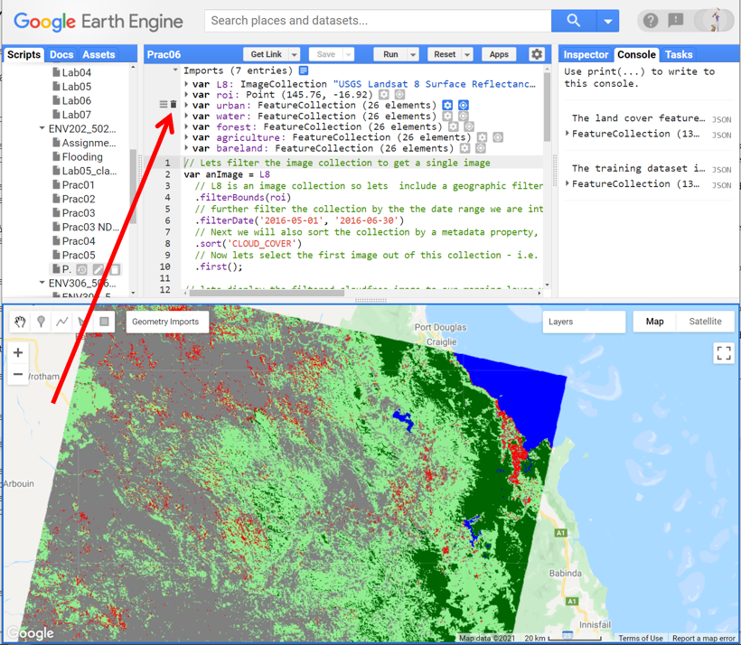
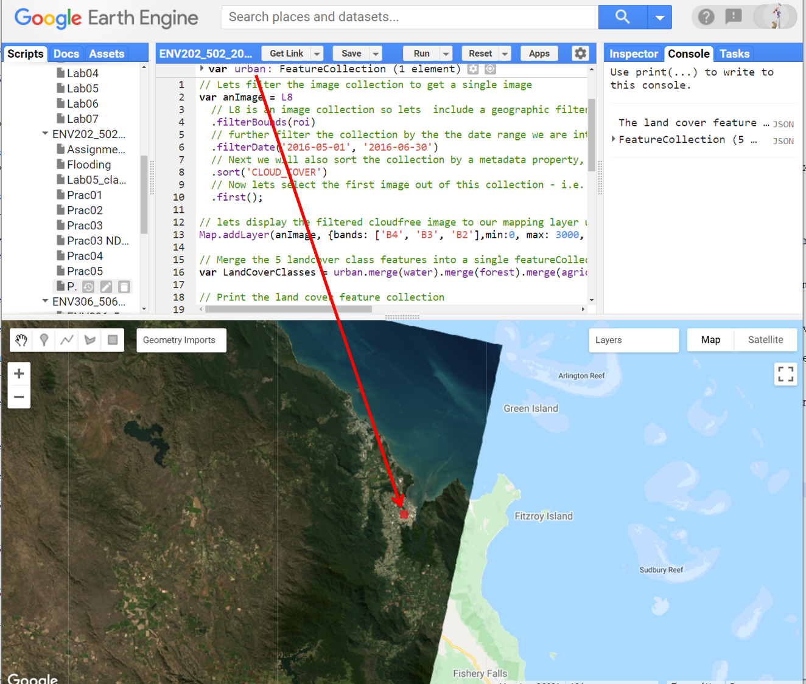
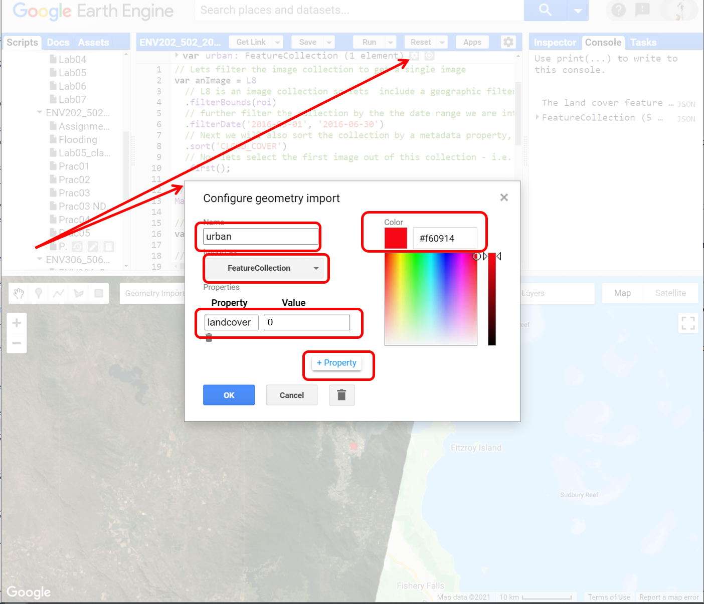
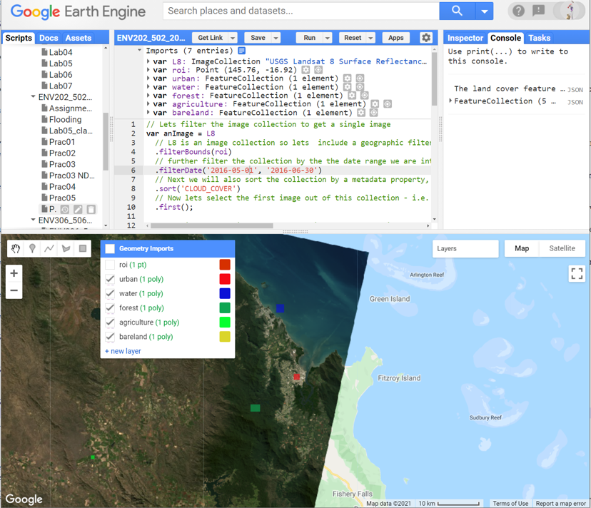
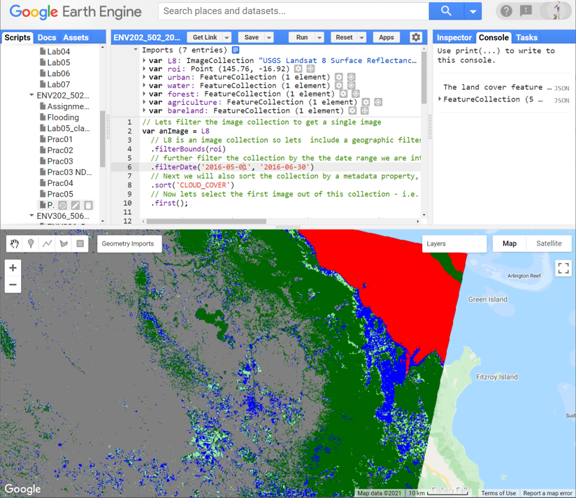

# Introductory Remote Sensing (ENV202/502)
Prac 6 - Image classification - part 2: validation and accuracy assessment
--------------

### Acknowledgments
- Google Earth Engine Team
- Google Earth Engine Developers group

------

### Prerequisites
--------------

Completion of this Prac exercise requires the use of the Google Chrome browser and a Google Earth Engine account. If you have not yet signed up - please do so now in a new tab: [Earth Engine account registration](https://signup.earthengine.google.com/)

Once registered you can access the Earth Engine environment here: https://code.earthengine.google.com

Google Earth Engine uses the JavaScript programming language. We will cover the very basics of this language during this course. If you would like more detail you can read through the introduction provided here: [JavaScript background](https://developers.google.com/earth-engine/tutorials/tutorial_js_01)

------------------------------------------------------------------------

### Objective

The objective of this Prac is to further your understanding of the image classification process, improve the classification from last week, and learn how to evaluate image classification results and conduct an accuracy assessment using independent validation data.

----------

## 1. Load up your previous classification work on Google EarthEngine

1. Open your script from the previous classification Prac last week's Prac. Make any minor change (e.g. add an enter at the end of the script) so you can save the script under a new name (e.g. Prac06).

2. If you did not save the script in Prac04, repeat the steps from [Prac 4](https://github.com/GautamDeepak/Intro_RS/blob/master/Intro_RS_Prac04.md) and be sure to save it this time. I have provided the full code below, but remember that you need to manually collect the training data and assign landcover properties.
```JavaScript
//Let's filter the image collection to get a single image
var anImage = L8
  // L8 is an image collection so let's include a geographic filter to narrow the search to images at the location of our point
  .filterBounds(roi)
  // further filter the collection by the date range we are interested in
  .filterDate('2016-05-01', '2016-06-30')
  // Next we will also sort the collection by a metadata property, in our case cloud cover is a very useful one
  .sort('CLOUD_COVER')
  // Now let's select the first image out of this collection - i.e. the most cloud-free image in the date range and over the region of interest
  .first();

//let's display the filtered cloud-free image to our mapping layer using true-colour composite
Map.addLayer(anImage, {bands: ['B4', 'B3', 'B2'],min:0, max: 3000, gamma:1.4}, 'True colour image');

// Merge the 5 landcover class features into a single featureCollection
var LandCoverClasses = urban.merge(water).merge(forest).merge(agriculture).merge(bareland);

// Print the land cover feature collection
print('The land cover feature collection is: ',LandCoverClasses);

// These will be the bands whose reflectance data will be extracted from the image for training purpose
var bands = ['B2', 'B3', 'B4', 'B5', 'B6', 'B7'];

// add new properties to the "LandCoverClasses" - the new property is the reflectance data from the above bands
LandCoverClasses = anImage.select(bands).sampleRegions({ // sample the reflectance from selected bands
  collection: LandCoverClasses, // save the reflectance to the LandCoverClasses
  properties: ['landcover'],
  scale: 30
});

// print our training dataset
print('The training dataset is: ', LandCoverClasses);

// train our classifier. Here we used cart classifier.
var classifier = ee.Classifier.smileCart().train({
  features: LandCoverClasses,
  classProperty: 'landcover',
  inputProperties: bands
});

//Run the classification for the entire scene
var classified = anImage.select(bands).classify(classifier);


//Display classified map. The color scheme defined below is set according to the numbering of the class. e.g. class0 was urban which is set to red
Map.centerObject(roi, 10);
Map.addLayer(classified, {min: 0, max: 4, palette: ['red', 'blue', 'darkgreen','lightgreen', 'gray']}, 'Classified map');

```
3. Run the script to get the classified map

[Figure 1. Classified map](Prac6/classified.PNG)

## 2. Use polygons instead of points to sample the training data.

1. Delete all the training datasets 



2. Follow the steps we learnt in Prac04 to re-sample the training data for classification - use polygon this time not point. Note you can sample more than one polygon for a landcover class. Start with urban landcover - do not exceed 5000 pixels. 



3. Follow the steps we learnt in Prac04 to configure the training data.



4. Repeat the above steps [step 2 and step 3] to define all the landcover types you want to include. Let's add water, forest, agriculture, bareland – same order as Prac04



5. Run the script to get a classified map. Here, the classifier used polygons instead of points for training. Compare this classification with the earlier classification where points were used for training. Do you notice an improvement in your classified map? 


## 3. Classification validation

1. Use the above procedure but now sample the validation dataset. 
  - do this in the same way you collected training data
  - use the same property names and labels
  - do not overlap the validation data with training data
  - do not exceed 5000 pixels
  - collect validation data for the same classes but call them differently (vUrban, vWater, vForest, vAgriculture, vBareland)
  
2. Merge your validation polygons into one Feature Collection

```JavaScript
//Merge validation polygons into one FeatureCollection
var valLandCoverClasses = vWater.merge(vUrban).merge(vForest).merge(vAgriculture).merge(vBareland);
```  
  
3. Sample your classification results to your new validation areas.  

```JavaScript
var validation = classified.sampleRegions({
  collection: valNames,
  properties: ['landcover'],
  scale: 30,
});
// print(validation); // This print will not work if you have sampled over 5000 pixels.
```

4. Run the validation assessment to compute error matrix 

```JavaScript
//Compare the landcover of your validation data against the classification result
var testAccuracy = validation.errorMatrix('landcover', 'classification');
//Print the error matrix to the console
print('Validation error matrix: ', testAccuracy);

```
5. EE has builtin functions to compute accuracies such as User's and Producer's accuracy, kappa coefficient. Run the script to compute the accuracies.
```JavaScript

//Print the overall accuracy to the console
print('Validation overall accuracy: ', testAccuracy.accuracy());

//Print the user's accuracy to the console
print('Validation overall accuracy: ', testAccuracy.consumersAccuracy());

//Print the producers accuracy to the console
print('Validation overall accuracy: ', testAccuracy.producersAccuracy());

//Print the kappa coefficient accuracy to the console
print('Validation overall accuracy: ', testAccuracy.kappa());
```

6. Think about how the classification went and what all these accuracies number mean.

## 4. Improving the Classification

Now you have the base accuracy assessment numbers. Are you happy with the classification result? How can we improve it and what are our options? Below are a few options for you to explore. Try them and if you are stuck, get back to me next class.

1. Changing the training sample size: - We have already tried this. By incorporating polyongs we are sampling from more than 25 pixels.

2. Changing the sampling strategy: - This is where you can try different sampling strategies we learnt in the class. Try experimenting with a stratified sampling approach.

3. Changing the classifier: - We used a CART classifier, we could try a different approach such as a support vector machine (SVM) or randomForest (randomForest) approach (search for these commands in the docs section).

4. Changing the input bands: - We classified the landscape using 6 bands [B2--B7]. You could always add additional bands which may improve the classification. 

6. Adding derived indices as input: - In addition to the bands, you could try to add ancillary information, such as elevation data, or a derived index such as NDVI, NDWI which may help better discrimination between the classes. 

5. Changing the input image: - We used a winter scene from Landsat-8. We could try a summer scene from Landsat-8, or switch over to a Sentinel-2 image.

## 5. Complete script

```JavaScript

// Lets filter the image collection to get a single image  
var anImage = L8
  // L8 is an image collection so lets  include a geographic filter to narrow the search to images at the location of our point
  .filterBounds(roi)
  // further filter the collection by the the date range we are interested in
  .filterDate('2016-05-01', '2016-06-30')
  // Next we will also sort the collection by a metadata property, in our case cloud cover is a very useful one
  .sort('CLOUD_COVER')
  // Now lets select the first image out of this collection - i.e. the most cloud free image in the date range and over the region of interest
  .first();

// lets display the filtered cloudfree image to our mapping layer using true color composite
Map.addLayer(anImage, {bands: ['B4', 'B3', 'B2'],min:0, max: 3000, gamma:1.4}, 'True colour image');

// Merge the 5 landcover class features into a single featureCollection
var LandCoverClasses = urban.merge(water).merge(forest).merge(agriculture).merge(bareland);

// Print the land cover feature collection
print('The land cover feature collection is: ',LandCoverClasses);

// These will be the bands whose reflectance data will be extracted from the image for training purpose
var bands = ['B2', 'B3', 'B4', 'B5', 'B6', 'B7'];

// add new properties to the "LandCoverClasses" - the new property is the reflectance data from the above bands
LandCoverClasses = anImage.select(bands).sampleRegions({ // sample the reflectance from selected bands
  collection: LandCoverClasses, // save the reflectance to the LandCoverClasses
  properties: ['landcover'],
  scale: 30
});

// train our classifier. Here we used cart classifier.
var classifier = ee.Classifier.smileCart().train({
  features: LandCoverClasses,
  classProperty: 'landcover',
  inputProperties: bands
});

//Run the classification for the entire scene
var classified = anImage.select(bands).classify(classifier);


//Display classified map. The color scheme defined below is set to according to the numbering of the class. e.g. class0 was urban which is set to red
Map.centerObject(roi, 10);
Map.addLayer(classified, {min: 0, max: 4, palette: ['red', 'blue', 'darkgreen','lightgreen', 'gray']}, 'Classified map');

//Merge validation polygons into one FeatureCollection
var valLandCoverClasses = vWater.merge(vUrban).merge(vForest).merge(vAgriculture).merge(vBareland);

var validation = classified.sampleRegions({
  collection: valLandCoverClasses,
  properties: ['landcover'],
  scale: 30,
});


//Compare the landcover of your validation data against the classification result
var testAccuracy = validation.errorMatrix('landcover', 'classification');

//Print the error matrix to the console
print('Validation error matrix: ', testAccuracy);

//Print the overall accuracy to the console
print('Validation overall accuracy: ', testAccuracy.accuracy());

//Print the user's accuracy to the console
print('Validation overall accuracy: ', testAccuracy.consumersAccuracy());

//Print the producers accuracy to the console
print('Validation overall accuracy: ', testAccuracy.producersAccuracy());

//Print the kappa coefficient accuracy to the console
print('Validation overall accuracy: ', testAccuracy.kappa());

```
-------
### Thank you

I hope you found that useful. A recorded video of this tutorial can be found on my YouTube Channel's [Introduction to Remote Sensing of the Environment Playlist](https://www.youtube.com/playlist?list=PLf6lu3bePWHDi3-lrSqiyInMGQXM34TSV).

#### Kind regards, Shaun R Levick (edit Deepak Gautam)
------


### The end
